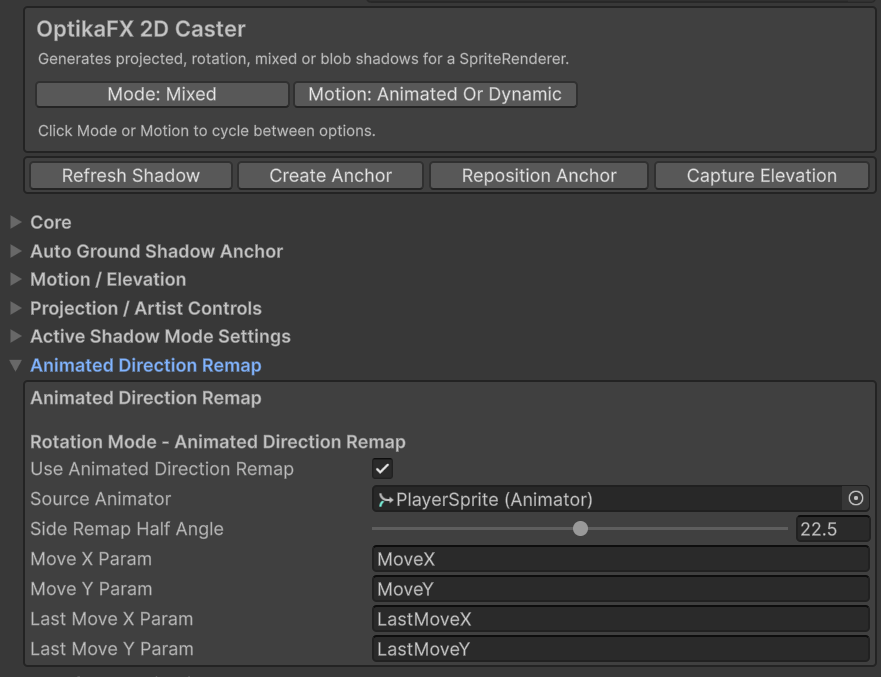
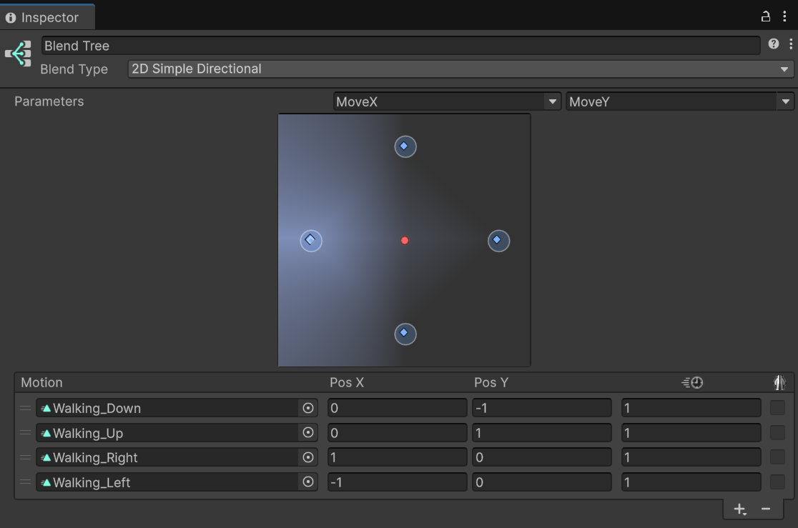
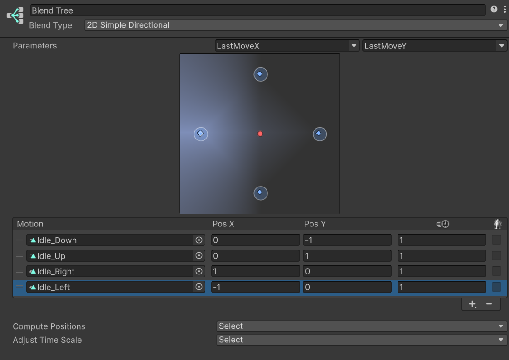
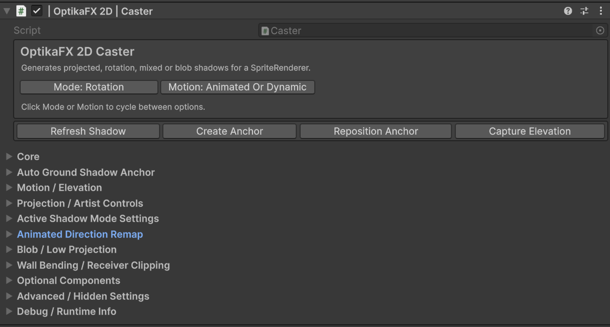


# Animator Blend Tree Setup for Auto Remap

Auto Remap allows the Caster to adjust shadow behavior based on the character's movement direction.

This is useful for animated characters that use a 2D Blend Tree with movement parameters such as `MoveX` and `MoveY`.

## Index

- [Overview](#overview)
- [When to Use Auto Remap](#when-to-use-auto-remap)
- [Compatibility](#compatibility)
- [Required Animator Parameters](#required-animator-parameters)
- [Blend Tree Setup](#blend-tree-setup)
- [Idle Direction Setup](#idle-direction-setup)
- [Caster Setup](#caster-setup)
- [Recommended Caster Settings](#recommended-caster-settings)
- [How Auto Remap Works](#how-auto-remap-works)
- [Horizontal Proxy vs Auto Remap](#horizontal-proxy-vs-auto-remap)
- [Troubleshooting](#troubleshooting)

---

## Overview



Auto Remap reads movement direction from the Animator and uses it to improve the shadow behavior for directional sprites.

It helps the Caster choose better directional behavior when a character faces or moves in different directions.

Auto Remap is especially useful for:

- Top-down characters
- Directional sprites
- Characters using Blend Trees
- Animated characters with front/back/side animations
- Shadows that should react to movement direction

---

## When to Use Auto Remap

Use Auto Remap when:

- The character uses directional animations.
- The character has a 2D Blend Tree.
- Shadows should react differently depending on movement direction.
- The Caster uses `Perspective`, `Rotation` or `Mixed` mode.
- You want better shadow behavior for side, front and back animations.

---

## Compatibility

Auto Remap can be used with:

| Caster Mode | Auto Remap |
|---|---|
| `Perspective` | Supported |
| `Rotation` | Supported |
| `Mixed` | Supported |
| `TopDownBlob` | Not recommended |

Horizontal Proxy is separate from Auto Remap.

| Feature | Perspective | Rotation | Mixed |
|---|---:|---:|---:|
| Auto Remap | No | Yes | Yes |
| Horizontal Proxy | Yes | No | No |

For Perspective mode, use Auto Remap via Horizontal Proxy.

For Rotation and Mixed modes, use Auto Remap and tune the mode-specific width/remap settings.

For more information, see:

- [Horizontal Proxy](horizontal-proxy.md)
- [Casters](casters.md)

---

## Required Animator Parameters

Your Animator Controller should have directional float parameters.

Recommended names:

| Parameter | Type | Description |
|---|---|---|
| `MoveX` | Float | Horizontal movement direction. |
| `MoveY` | Float | Vertical movement direction. |
| `LastMoveX` | Float | Last horizontal direction used when the character stops. |
| `LastMoveY` | Float | Last vertical direction used when the character stops. |

Example values:

| Direction | MoveX | MoveY |
|---|---:|---:|
| Right | 1 | 0 |
| Left | -1 | 0 |
| Up | 0 | 1 |
| Down | 0 | -1 |
| Idle Right | LastMoveX = 1 | LastMoveY = 0 |
| Idle Left | LastMoveX = -1 | LastMoveY = 0 |
| Idle Up | LastMoveX = 0 | LastMoveY = 1 |
| Idle Down | LastMoveX = 0 | LastMoveY = -1 |

---

## Blend Tree Setup



Create a 2D Blend Tree in your Animator Controller.

Recommended Blend Type:

```text
2D Simple Directional
```

or:

```text
2D Freeform Directional
```

Use these parameters:

```text
MoveX
MoveY
```

Add your directional animations using positions like:

| Animation | Pos X | Pos Y |
|---|---:|---:|
| Walk Right | 1 | 0 |
| Walk Left | -1 | 0 |
| Walk Up | 0 | 1 |
| Walk Down | 0 | -1 |

---

## Idle Direction Setup




For idle animations, use `LastMoveX` and `LastMoveY`.

When the character stops moving, store the last non-zero direction.

Example:

```csharp
using UnityEngine;

public class PlayerAnimatorDirection : MonoBehaviour
{
    [SerializeField]
    private Animator animator;

    private void Update()
    {
        Vector2 input = new Vector2(Input.GetAxisRaw("Horizontal"), Input.GetAxisRaw("Vertical"));

        if (input.sqrMagnitude > 1f)
            input.Normalize();

        animator.SetFloat("MoveX", input.x);
        animator.SetFloat("MoveY", input.y);

        if (input.sqrMagnitude > 0.001f)
        {
            animator.SetFloat("LastMoveX", input.x);
            animator.SetFloat("LastMoveY", input.y);
        }
    }
}
```

If you use the Input System, replace the input reading with your own movement vector.

Important:

Do not reset `LastMoveX` and `LastMoveY` to zero when the character stops.

---

## Caster Setup

Select the character GameObject and open the `Caster` component.

Use one of these modes:

- `Rotation`
- `Mixed`

Then open the Animated Direction Remap.



Enable:

```text
Use Animated Direction Remap
```

Assign:

| Caster Field | Animator Parameter |
|---|---|
| `Source Animator` | The character Animator |
| `Move X Param` | `MoveX` |
| `Move Y Param` | `MoveY` |
| `Last Move X Param` | `LastMoveX` |
| `Last Move Y Param` | `LastMoveY` |

---

## Recommended Caster Settings

For animated characters:

| Field | Recommended Value |
|---|---|
| `Shadow Mode` | `Mixed` or `Rotation` |
| `Caster Motion Mode` | `Animated Or Dynamic` |
| `Use Animated Direction Remap` | Enabled |
| `Source Animator` | Character Animator |
| `Move X Param` | `MoveX` |
| `Move Y Param` | `MoveY` |
| `Last Move X Param` | `LastMoveX` |
| `Last Move Y Param` | `LastMoveY` |

For characters using `Perspective` mode and thin horizontal shadows, consider using Horizontal Proxy as well.

For more information, see:

- [Horizontal Proxy](horizontal-proxy.md)

---

## How Auto Remap Works

The Caster reads the movement direction from the Animator parameters.

When the character is moving, it uses:

```text
MoveX
MoveY
```

When the character is idle, it can use:

```text
LastMoveX
LastMoveY
```

This allows the shadow to stay consistent with the direction the character is facing.

For example:

- Moving right makes the shadow behave as a side-facing shadow.
- Moving up can use a back-facing remap.
- Moving down can use a front-facing remap.
- Idle keeps the last valid direction.

---

## Horizontal Proxy vs Auto Remap

Auto Remap and Horizontal Proxy solve related but different problems.

### Auto Remap

Auto Remap reads Animator direction parameters and adjusts Caster behavior based on movement direction.

Use Auto Remap for:

- Directional characters
- Blend Tree animation
- Movement-based shadow behavior
- Perspective, Rotation and Mixed modes

### Horizontal Proxy

Horizontal Proxy uses an alternate proxy shape for horizontal projections.

Use Horizontal Proxy for:

- Perspective mode only
- Thin horizontal projected shadows
- Custom side-facing projection silhouettes

---

## Troubleshooting

### Auto remap does not work

Check:

- The Caster is in `Perspective`, `Rotation` or `Mixed` mode.
- `Use Animated Direction Remap` is enabled.
- `Source Animator` is assigned.
- Animator parameter names match exactly.
- Parameters are Float type.
- `MoveX` and `MoveY` are being updated at runtime.
- `LastMoveX` and `LastMoveY` are being updated when movement input is not zero.

---

### Shadow uses the wrong direction

Check:

- Your Blend Tree positions.
- Your MoveX/MoveY values.
- Your character sprite orientation.
- `Side Remap Half Angle`.
- Perspective/Rotation/Mixed remap settings.
- SpriteRenderer flip settings.

---

### Shadow changes when stopping

Make sure you update `LastMoveX` and `LastMoveY` only when movement input is not zero.

Use this pattern:

```csharp
if (input.sqrMagnitude > 0.001f)
{
    animator.SetFloat("LastMoveX", input.x);
    animator.SetFloat("LastMoveY", input.y);
}
```

Do not set `LastMoveX` and `LastMoveY` to zero when the character stops.

---

### Idle shadow always faces down

This usually means `LastMoveX` and `LastMoveY` are not being updated, or the Animator parameters are missing.

Check:

- `LastMoveX` exists.
- `LastMoveY` exists.
- Both are Float parameters.
- They are updated only when movement input is not zero.

---

### Shadow becomes too thin at horizontal angles

For `Perspective` mode:

- Use Horizontal Proxy.
- Increase proxy width or scale.
- Adjust projection and flatten settings.

For `Rotation` and `Mixed` modes:

- Use Auto Remap.
- Tune width/remap settings in the Caster inspector.
- Check Blend Tree directions.

For more information, see:

- [Horizontal Proxy](horizontal-proxy.md)
- [Casters](casters.md)

---

← [Back to Documentation Index](index.md)
