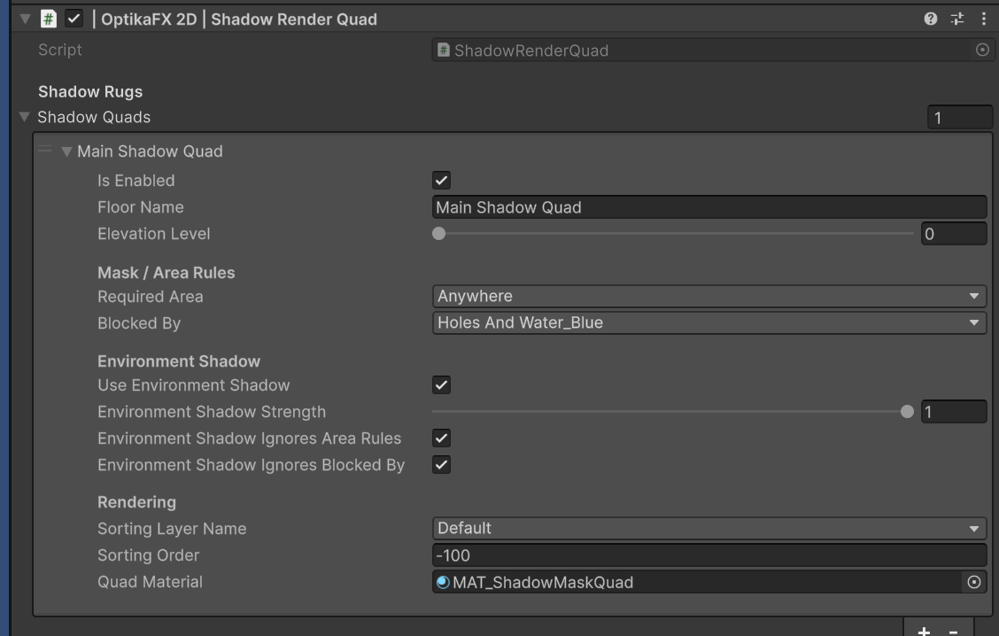

# Camera and Shadow Rugs

The camera setup is responsible for rendering the final OptikaFX 2D shadow layer.

OptikaFX uses a `ShadowRenderQuad` component on the camera. Each entry in this component is a shadow rug, also called a shadow quad.

A shadow rug is a full-screen or camera-aligned quad that displays the resolved shadow mask using specific rules such as elevation, area type, blocking and sorting.

## Index

- [Overview](#overview)
- [Camera Setup](#camera-setup)
- [ShadowRenderQuad](#shadowrenderquad)
- [What Are Shadow Rugs](#what-are-shadow-rugs)
- [Main Fields](#main-fields)
- [Shadow Rug Fields](#shadow-rug-fields)
- [Area Rules](#area-rules)
- [Blocked By Rules](#blocked-by-rules)
- [Elevation Level](#elevation-level)
- [Environment Shadow](#environment-shadow)
- [Sorting Layer and Order](#sorting-layer-and-order)
- [Multiple Shadow Rugs](#multiple-shadow-rugs)
- [Recommended Setup](#recommended-setup)
- [Useful C# Examples](#useful-c-examples)
  - [Get ShadowRenderQuad from camera](#get-shadowrenderquad-from-camera)
  - [Enable or disable first shadow rug](#enable-or-disable-first-shadow-rug)
  - [Set shadow rug material](#set-shadow-rug-material)
  - [Set sorting order](#set-sorting-order)
- [Troubleshooting](#troubleshooting)

---

## Overview

OptikaFX renders shadows through render textures and mask passes.

The final visible shadow layer is drawn by the camera using `ShadowRenderQuad`.

The `ShadowRenderQuad` contains one or more shadow rugs.

Each shadow rug defines:

- Which elevation level it renders
- Where shadows are allowed to appear
- What blocks the shadows
- Whether environment shadows are included
- Which material is used
- Sorting layer and sorting order

---

## Camera Setup

Full Setup automatically configures the active camera.

Menu:

    Tools / OptikaFX 2D / 01. Run Full Setup

After setup, your main camera should have:

- `Camera`
- `ShadowRenderQuad`

The `ShadowRenderQuad` component is required for final shadow display.

If the camera does not have this component, shadows may be generated internally but not visible on screen.

---

## ShadowRenderQuad



`ShadowRenderQuad` is attached to the camera.

It creates and updates shadow rug quads as camera children.

These quads are usually hidden/internal generated objects.

The component contains a list:

    Shadow Quads

Each element in this list represents one shadow rug.

---

## What Are Shadow Rugs

A shadow rug is a camera-aligned quad that receives and displays the resolved shadow mask.

Think of it as a visual layer where shadows are drawn.

You can use multiple rugs for:

- Different elevation levels
- Different sorting layers
- Ground-only shadows
- Wall-only shadows
- Environment shadows
- Special rendering passes

---

## Main Fields

Common ShadowRenderQuad fields include:

| Field | Description |
|---|---|
| `Shadow Rugs` | List of shadow rug configurations. |
| `Final Shadow Color` | Controls how final shadow tint is resolved. |
| `Use Day Night Shadow Tint` | Uses GlobalLight or TimeManager shadow color when available. |
| `Fallback Shadow Tint` | Color used if no GlobalLight/TimeManager color is available. |

Names may vary depending on inspector version.

---

## Shadow Rug Fields

Each shadow rug entry can contain:

| Field | Description |
|---|---|
| `Is Enabled` | Enables or disables this shadow rug. |
| `Floor Name` | Display name for the rug. |
| `Elevation Level` | Elevation level rendered by this rug. |
| `Required Area` | Defines where this rug can draw shadows. |
| `Blocked By` | Defines what blocks this rug. |
| `Use Environment Shadow` | Includes environment/occluder shadows. |
| `Environment Shadow Strength` | Strength of environment shadows. |
| `Environment Shadow Ignores Area Rules` | Allows environment shadows to ignore Required Area. |
| `Environment Shadow Ignores Blocked By` | Allows environment shadows to ignore Blocked By rules. |
| `Sorting Layer Name` | Sorting layer used by the rug renderer. |
| `Sorting Order` | Sorting order used by the rug renderer. |
| `Quad Material` | Material used to render this rug. |

---

## Area Rules

`Required Area` controls where the rug can draw shadows.

Common options:

| Required Area | Description |
|---|---|
| `Anywhere` | Shadows can appear on any valid area. |
| `Only On Ground` | Shadows appear only on ground/floor areas. |
| `Only On Wall` | Shadows appear only on wall areas. |

Use this to separate ground shadows from wall shadows.

Example:

- Ground rug uses `Only On Ground`
- Wall rug uses `Only On Wall`

---

## Blocked By Rules

`Blocked By` controls what can block shadows.

Common options:

| Blocked By | Description |
|---|---|
| `Nothing` | Nothing blocks this rug. |
| `Holes And Water` | Hole/water areas block shadows. |

Use `Holes And Water` when shadows should not appear over holes, water or void areas.

---

## Elevation Level

Elevation Level lets you render shadows for different height layers.

Use elevation levels for:

- Platforms
- Bridges
- Multi-floor scenes
- Raised terrain
- Separate vertical layers

Caster, receiver and rug elevation should match when needed.

Example:

| Object | Elevation |
|---|---:|
| Ground receiver | `0` |
| Player caster | `0` |
| Shadow rug | `0` |

For a raised platform:

| Object | Elevation |
|---|---:|
| Platform receiver | `1` |
| Platform caster | `1` |
| Shadow rug | `1` |

---

## Environment Shadow

Environment shadows usually come from occluders or environmental shadow passes.

Use:

    Use Environment Shadow

when this rug should include environment/occluder shadows.

Useful settings:

| Field | Description |
|---|---|
| `Environment Shadow Strength` | Controls environment shadow opacity. |
| `Environment Shadow Ignores Area Rules` | Environment shadows draw even if area rules would block them. |
| `Environment Shadow Ignores Blocked By` | Environment shadows ignore hole/water blocking rules. |

Recommended:

- Enable environment shadow on only one main rug unless you need multiple environment layers.
- Avoid duplicating environment shadow on many rugs unless intentional.

---

## Sorting Layer and Order

The rug is rendered using Unity sorting.

Important fields:

| Field | Description |
|---|---|
| `Sorting Layer Name` | Unity sorting layer. |
| `Sorting Order` | Draw order inside the sorting layer. |

If shadows appear behind or in front of the wrong objects, adjust sorting.

Common setup:

| Use | Sorting Layer | Sorting Order |
|---|---|---:|
| Ground shadows | Default | `-100` |
| Wall shadows | Default | `-90` |
| Special overlay shadows | Custom layer | Depends on project |

Sorting depends heavily on your project rendering order.

---

## Multiple Shadow Rugs

You can use multiple shadow rugs.

Examples:

### One simple rug

Use one rug for all basic shadows.

Recommended for simple projects.

### Ground and wall rugs

Use two rugs:

| Rug | Required Area | Purpose |
|---|---|---|
| Ground Rug | Only On Ground | Ground shadows |
| Wall Rug | Only On Wall | Wall shadows |

### Elevation rugs

Use one rug per elevation level:

| Rug | Elevation |
|---|---:|
| Ground Level Rug | 0 |
| Platform Rug | 1 |
| Upper Platform Rug | 2 |

### Environment rug

Use one rug with environment shadow enabled.

This allows occluders/environment masks to be shown.

---

## Recommended Setup

For most projects:

1. Run Full Setup.
2. Select the Main Camera.
3. Confirm `ShadowRenderQuad` exists.
4. Open `Shadow Rugs`.
5. Make sure at least one rug is enabled.
6. Confirm `Quad Material` is assigned.
7. Set `Required Area` to `Anywhere` or `Only On Ground`.
8. Set `Blocked By` to `Holes And Water` if needed.
9. Set Sorting Layer and Order to match your scene.

Simple recommended rug:

| Field | Value |
|---|---|
| `Is Enabled` | Enabled |
| `Elevation Level` | `0` |
| `Required Area` | `Anywhere` |
| `Blocked By` | `Holes And Water` |
| `Use Environment Shadow` | Enabled |
| `Sorting Layer Name` | `Default` |
| `Sorting Order` | `-100` |
| `Quad Material` | Default ShadowMaskSortedQuad material |

---

## Useful C# Examples

---

## Get ShadowRenderQuad from camera
```csharp
using UnityEngine;
using OptikaFX;

public class ShadowRenderQuadExample : MonoBehaviour
{
    private ShadowRenderQuad shadowRenderQuad;

    private void Awake()
    {
        Camera cam = Camera.main;

        if (cam == null)
            return;

        shadowRenderQuad = cam.GetComponent<ShadowRenderQuad>();
    }
}

```
---

## Enable or disable first shadow rug
```csharp
using UnityEngine;
using OptikaFX;

public class ToggleFirstShadowRug : MonoBehaviour
{
    [SerializeField]
    private ShadowRenderQuad shadowRenderQuad;

    public void SetFirstRugEnabled(bool enabled)
    {
        if (shadowRenderQuad == null)
            return;

        if (shadowRenderQuad.shadowQuads == null || shadowRenderQuad.shadowQuads.Count == 0)
        {
            return;
        }

        shadowRenderQuad.shadowQuads[0].isEnabled = enabled;
    }
}

```
---

## Set shadow rug material
```csharp
using UnityEngine;
using OptikaFX;

public class ShadowRugMaterialExample : MonoBehaviour
{
    [SerializeField]
    private ShadowRenderQuad shadowRenderQuad;

    [SerializeField]
    private Material rugMaterial;

    public void ApplyMaterialToFirstRug()
    {
        if (shadowRenderQuad == null)
            return;

        if (shadowRenderQuad.shadowQuads == null || shadowRenderQuad.shadowQuads.Count == 0)
        {
            return;
        }

        shadowRenderQuad.shadowQuads[0].quadMaterial = rugMaterial;
    }
}

```
---

## Set sorting order
```csharp
using UnityEngine;
using OptikaFX;

public class ShadowRugSortingExample : MonoBehaviour
{
    [SerializeField]
    private ShadowRenderQuad shadowRenderQuad;

    public void SetFirstRugSortingOrder(int order)
    {
        if (shadowRenderQuad == null)
            return;

        if (shadowRenderQuad.shadowQuads == null || shadowRenderQuad.shadowQuads.Count == 0)
        {
            return;
        }

        shadowRenderQuad.shadowQuads[0].sortingOrder = order;
    }
}

```
---

## Troubleshooting

### Shadows are not visible

Check:

- The camera has a `ShadowRenderQuad` component.
- At least one shadow rug is enabled.
- `Quad Material` is assigned.
- Sorting Layer and Sorting Order are correct.
- GlobalLight exists.
- Caster exists.
- Receiver exists.
- Render Features are installed.

### Shadows render behind sprites

Adjust:

- Shadow rug `Sorting Layer Name`
- Shadow rug `Sorting Order`
- SpriteRenderer sorting settings
- TilemapRenderer sorting settings

### Shadows render over everything

Lower the shadow rug sorting order.

Example:

    Sorting Order: -100

Or use a sorting layer that renders below characters.

### Shadows appear on wrong area

Check:

- `Required Area`
- `Blocked By`
- ShadowArea type
- Receiver type
- Elevation Level

### Environment shadows are duplicated

Check if `Use Environment Shadow` is enabled on more than one rug.

Usually only one main rug should include environment shadows.

### Shadows appear on water or holes

Set:

    Blocked By: Holes And Water

Also make sure water/hole objects have the correct `ShadowArea` type.

### Shadows are missing on walls

Check:

- Wall receiver exists.
- ShadowArea type is Wall.
- A rug exists for wall shadows.
- `Required Area` allows wall rendering.
- Sorting order places wall shadows correctly.

← [Back to Documentation Index](index.md)
