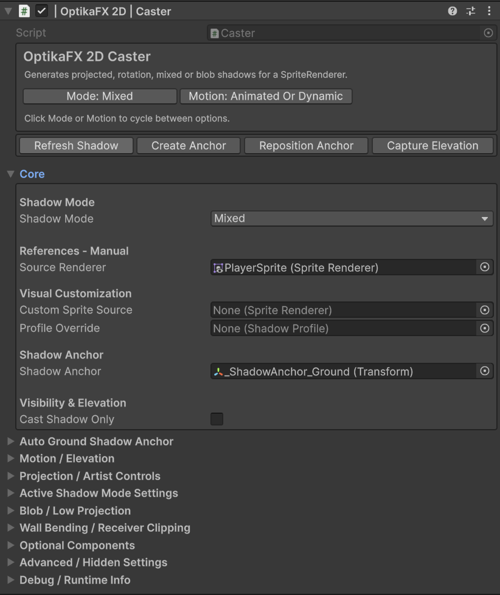
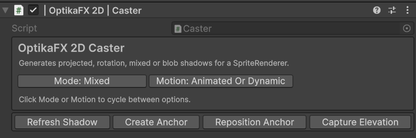
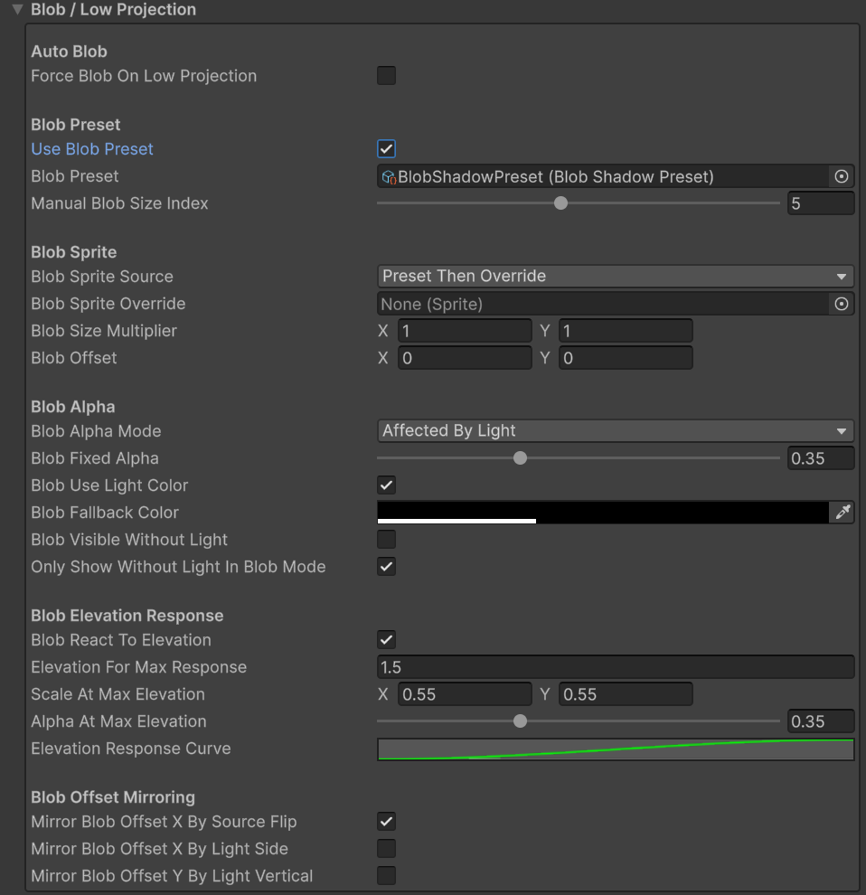
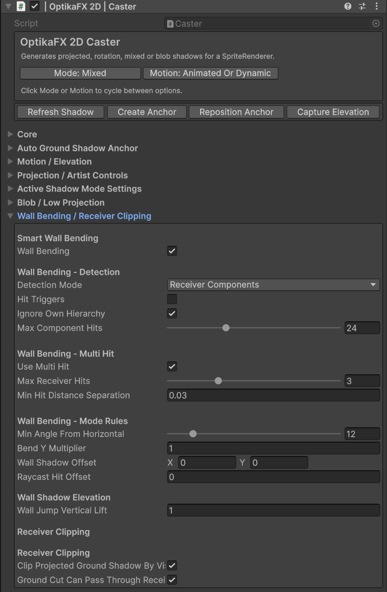
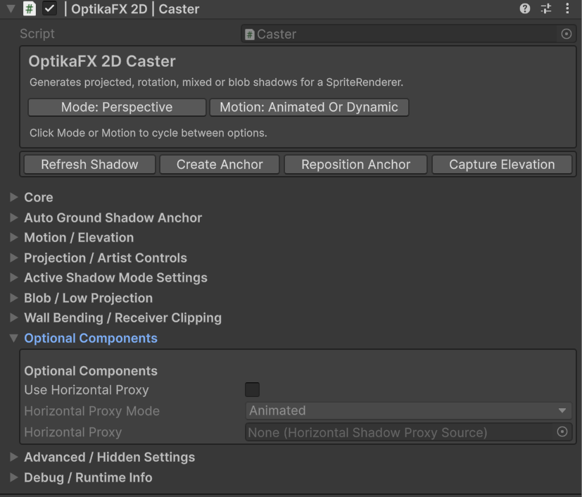


# Casters

The `Caster` component generates shadows from SpriteRenderer objects in OptikaFX 2D.

Casters can create projected shadows, rotation-based shadows, mixed shadows and blob shadows.

## Index

- [Overview](#overview)
- [When to Use Casters](#when-to-use-casters)
- [Caster Shadow Modes](#caster-shadow-modes)
- [Perspective Mode](#perspective-mode)
- [Rotation Mode](#rotation-mode)
- [Mixed Mode](#mixed-mode)
- [Blob Mode](#blob-mode)
- [Main Fields](#main-fields)
- [Source Renderer](#source-renderer)
- [Shadow Anchor](#shadow-anchor)
- [Motion and Elevation](#motion-and-elevation)
- [Projection Controls](#projection-controls)
- [Blob Settings](#blob-settings)
- [Wall Bending](#wall-bending)
- [Optional Components](#optional-components)
- [Recommended Setup](#recommended-setup)
- [Useful C# Examples](#useful-c-examples)
  - [Get a Caster component](#get-a-caster-component)
  - [Refresh a caster shadow](#refresh-a-caster-shadow)
  - [Change shadow mode](#change-shadow-mode)
  - [Enable cast shadow only](#enable-cast-shadow-only)
  - [Assign source renderer](#assign-source-renderer)
  - [Assign shadow profile](#assign-shadow-profile)
  - [Set alpha multiplier](#set-alpha-multiplier)
  - [Set projection length](#set-projection-length)
  - [Use blob preset](#use-blob-preset)
- [Troubleshooting](#troubleshooting)

---

## Overview



`Caster` is responsible for generating shadow objects from a sprite.

It uses a `SpriteRenderer` as the visual source and creates shadow meshes/sprites based on the selected shadow mode.

A caster can be affected by:

- Global Light
- Local Lights
- ShadowProfile
- Elevation
- Wall bending receivers
- Blob presets
- Shadow anchor position

For animated characters and directional sprites, see:

- [Animator Blend Tree Setup for Auto Remap](animator-blend-tree-setup.md)

If you are using `Perspective` mode and shadows become too thin at horizontal angles, see:

- [Horizontal Shadow Proxy](horizontal-proxy.md)

> Note: Horizontal Proxy works only with `Perspective` mode.  
> For `Rotation` and `Mixed` modes, use Animator Auto Remap only.

---

## When to Use Casters

Use a Caster on objects that should cast shadows, such as:

- Characters
- Trees
- Rocks
- Props
- Buildings
- Furniture
- Animated sprites
- Objects affected by local lights

Usually, a Caster should be added to a GameObject with a `SpriteRenderer`, or to a parent that contains a child `SpriteRenderer`.

---

## Caster Shadow Modes



The Caster supports multiple shadow modes:

| Mode | Description |
|---|---|
| `Perspective` | Projects the sprite based on light direction. Best for classic ground shadows. Supports Horizontal Proxy. |
| `Rotation` | Rotates/flattens the sprite shape instead of projecting it. Useful for top-down or stylized shadows. Uses Auto Remap for directional animation. |
| `Mixed` | Blends between perspective and rotation behavior. Useful for flexible character/object shadows. Uses Auto Remap for directional animation. |
| `TopDownBlob` | Uses blob sprites for simple top-down contact shadows. |

---

## Perspective Mode

Perspective mode creates projected shadows based on light direction.

Use it for:

- Objects casting long shadows
- Outdoor sunlight/moonlight shadows
- Props and trees
- Characters in side/top-down hybrids

Important controls:

- `Projection Length Multiplier`
- `Flatten Multiplier`
- `Hinge Offset`
- `Clip Shadow Below Pivot`
- Base fade and blur settings

Perspective mode supports:

- Global Light direction
- Local Light influence
- Wall bending
- Horizontal Proxy

Horizontal Proxy is available only in Perspective mode and can help avoid very thin shadows at horizontal angles.

For more information, see:

- [Horizontal Shadow Proxy](horizontal-proxy.md)
- [Wall Bending](wall-bending.md)
- [Receivers](receivers.md)

---

## Rotation Mode

Rotation mode creates a rotated shadow shape rather than a long projection.

Use it for:

- Top-down games
- Stylized shadows
- Objects that need compact directional shadows
- Cases where perspective projection is too aggressive

Important controls:

- Anchor point
- Local shape scale
- Width multiplier
- Projection length to local Y scale
- Ellipse anchor settings
- Animator Auto Remap

> Horizontal Proxy is not used in Rotation mode.  
> Use Animator Auto Remap for directional characters.

For more information, see:

- [Animator Blend Tree Setup for Auto Remap](animator-blend-tree-setup.md)

---

## Mixed Mode

Mixed mode combines projection and rotation behavior.

Use it for:

- Characters
- Animated objects
- Sprites that need different behavior depending on light angle
- Cases where perspective looks good in some angles but rotation works better in others

Important controls:

- Static/animated rotation start angle
- Full rotation angle
- Rotation remap threshold
- Horizontal width multiplier
- Mixed ellipse anchor
- Wall bending support
- Animator Auto Remap

Mixed mode is recommended for animated characters using directional movement.

> Horizontal Proxy is not used in Mixed mode.  
> Use Animator Auto Remap for directional characters and tune the Mixed mode width/remap settings.

For best results, see:

- [Animator Blend Tree Setup for Auto Remap](animator-blend-tree-setup.md)

---

## Blob Mode

Blob mode uses predefined blob sprites instead of projected sprite shadows.

Use it for:

- Top-down contact shadows
- Simple character shadows
- Low projection cases
- Performance-friendly shadows
- Stylized games

Blob mode can use a `BlobShadowPreset`.

Blob shadows are contact shadows and are not intended for wall bending.

For wall interaction, use `Perspective` or `Mixed` mode instead.

See:

- [Wall Bending](wall-bending.md)

---

## Main Fields

Common Caster fields include:

| Field | Description |
|---|---|
| `Shadow Mode` | Selects Perspective, Rotation, Mixed or Blob behavior. |
| `Source Renderer` | SpriteRenderer used as the shadow source. |
| `Custom Sprite Source` | Optional custom sprite source. |
| `Profile Override` | Optional ShadowProfile override for this caster. |
| `Shadow Anchor` | Transform used as the shadow origin/ground contact point. |
| `Cast Shadow Only` | If enabled, the source sprite can be hidden while the shadow remains. |
| `Caster Motion Mode` | Controls how motion/elevation is interpreted. |
| `Elevation Level` | Elevation layer used for sorting and receiver matching. |
| `Alpha Multiplier` | Multiplies shadow opacity. |
| `Projection Length Multiplier` | Controls projected shadow length. |
| `Flatten Multiplier` | Controls projected shadow flattening. |

Names may vary slightly depending on the custom inspector version.

---

## Source Renderer

The `Source Renderer` is the SpriteRenderer used to generate the shadow.

If this field is empty, the Caster cannot generate a correct shadow.

When adding a caster through the menu, OptikaFX tries to find the best SpriteRenderer automatically.

Common issues:

- Source Renderer is missing
- Source Renderer points to a generated shadow object
- SpriteRenderer is inside a disabled child object

---

## Shadow Anchor

The shadow anchor defines where the shadow is grounded.

Usually this should be placed near the feet/base of the object.

For characters, the anchor is commonly placed at the bottom of the sprite.

OptikaFX can auto-create a ground shadow anchor when needed.

---

## Motion and Elevation

The Caster can use motion/elevation settings to adjust shadow behavior.

Useful fields:

| Field | Description |
|---|---|
| `Caster Motion Mode` | Defines if the caster is static, grounded or animated/dynamic. |
| `Static Elevation Offset` | Manual elevation offset for static grounded casters. |
| `Auto Calculate Elevation` | Automatically calculates elevation from a transform. |
| `Elevation Source` | Transform used for elevation calculation. |
| `Elevation Multiplier` | Multiplies calculated elevation. |
| `Elevation Bias` | Adds extra elevation offset. |

Elevation is useful for:

- Flying objects
- Stairs/platforms
- Multi-level scenes

Make sure caster elevation matches the receiver and camera shadow rug when needed.

For more information, see:

- [Receivers](receivers.md)
- [Camera](camera.md)

---

## Projection Controls

Projection controls change the look of perspective shadows.

Useful fields:

| Field | Description |
|---|---|
| `Use Global Light Direction` | Uses the global light direction instead of a local angle override. |
| `Local Light Angle Offset` | Adds an angle offset for local light calculations. |
| `Alpha Multiplier` | Controls final shadow opacity. |
| `Projection Length Multiplier` | Controls shadow length. |
| `Flatten Multiplier` | Controls vertical flattening. |
| `Hinge Offset` | Adjusts where the shadow bends/projection starts. |
| `Clip Shadow Below Pivot` | Clips shadow below the sprite pivot. |

Projection is affected by:

- Global Light
- Local Lights
- TimeManager lighting presets
- ShadowProfile settings

For more information, see:

- [Global Light](global-light.md)
- [Local Light](local-light.md)
- [TimeManager](time-manager.md)

---

## Blob Settings



Blob settings are used by `TopDownBlob` mode or low projection fallback.

Useful fields:

| Field | Description |
|---|---|
| `Force Blob On Low Projection` | Uses blob shadow when projection is too low. |
| `Blob Projection Threshold` | Projection amount below which blob can appear. |
| `Blob Transition Mode` | Controls how projection blends into blob. |
| `Use Blob Preset` | Uses a BlobShadowPreset asset. |
| `Blob Preset` | Preset containing blob sprites by size. |
| `Manual Blob Size Index` | Manually selects blob size. |
| `Blob Size Multiplier` | Scales blob size. |
| `Blob Offset` | Offsets blob relative to anchor. |
| `Blob Alpha Mode` | Controls blob opacity behavior. |
| `Blob Use Light Color` | Uses light color for blob shadow tint. |

Blob mode is useful for simple top-down character shadows and performance-friendly contact shadows.

---

## Wall Bending



Wall bending allows projected shadows to interact with wall receivers.

Use it when shadows should bend or clip against walls.

Useful fields:

| Field | Description |
|---|---|
| `Wall Bending` | Enables wall bending behavior. |
| `Detection Mode` | Defines how receivers/walls are detected. |
| `Wall Layer` | Optional physics layer for wall detection. |
| `Ignore Own Hierarchy` | Prevents self-hits. |
| `Use Multi Hit` | Allows multiple receiver hits. |
| `Max Receiver Hits` | Limits receiver hit count. |
| `Min Angle From Horizontal` | Minimum angle required for bending. |
| `Wall Shadow Offset` | Offsets wall-projected shadow. |

Wall bending requires compatible wall receivers.

Occluders are not compatible with wall bending.

For more information, see:

- [Wall Bending](wall-bending.md)
- [Receivers](receivers.md)
- [Occluders](occluders.md)

---

## Optional Components



Some caster features use optional helper objects/components.

Important:

- Horizontal Proxy works only with `Perspective` mode.
- `Rotation` and `Mixed` modes use Animator Auto Remap instead.

For animated characters and horizontal shadow issues, see:

- [Animator Blend Tree Setup for Auto Remap](animator-blend-tree-setup.md)
- [Horizontal Shadow Proxy](horizontal-proxy.md)

---

## Recommended Setup

For a basic sprite shadow:

1. Select a sprite GameObject.
2. Right-click in the Hierarchy.
3. Choose:

    OptikaFX 2D / Add Casters To Selected GameObjects / Perspective


4. Select the object.
5. Confirm the `Caster` component has a valid `Source Renderer`.
6. Adjust `Shadow Mode`, `Projection Length Multiplier` and `Alpha Multiplier`.

For characters using Perspective mode:

1. Use `Perspective` mode.
2. Enable auto ground shadow anchor.
3. Configure elevation if the character can jump.
4. Use Horizontal Proxy if side/horizontal shadows become too thin.

See:

- [Horizontal Shadow Proxy](horizontal-proxy.md)

For characters using Rotation or Mixed mode:

1. Use `Rotation` or `Mixed` mode.
2. Set `Caster Motion Mode` to animated/dynamic.
3. Enable Animator Auto Remap.
4. Configure Animator movement parameters.
5. Tune width/remap settings if horizontal movement looks too thin.

See:

- [Animator Blend Tree Setup for Auto Remap](animator-blend-tree-setup.md)

For simple top-down games:

1. Use `TopDownBlob` mode.
2. Assign a `BlobShadowPreset`.
3. Adjust blob size and alpha.

---

## Useful C# Examples

---

## Get a Caster component

```csharp
using UnityEngine;
using OptikaFX;

public class CasterExample : MonoBehaviour
{
    private Caster caster;

    private void Awake()
    {
        caster = GetComponent<Caster>();
    }
}
```

---

## Refresh a caster shadow

```csharp
using UnityEngine;
using OptikaFX;

public class RefreshCasterExample : MonoBehaviour
{
    [SerializeField]
    private Caster caster;

    public void RefreshShadow()
    {
        if (caster == null)
            return;

        caster.RefreshShadowNow();
    }
}

```

---

## Change shadow mode

```csharp
using UnityEngine;
using OptikaFX;

public class ChangeCasterModeExample : MonoBehaviour
{
    [SerializeField]
    private Caster caster;

    public void SetPerspective()
    {
        if (caster == null)
            return;

        caster.shadowMode = Caster.ShadowRenderMode.Perspective;

        caster.RefreshShadowNow();
    }

    public void SetMixed()
    {
        if (caster == null)
            return;

        caster.shadowMode = Caster.ShadowRenderMode.Mixed;

        caster.RefreshShadowNow();
    }

    public void SetBlob()
    {
        if (caster == null)
            return;

        caster.shadowMode = Caster.ShadowRenderMode.TopDownBlob;

        caster.RefreshShadowNow();
    }
}
```

---

## Enable cast shadow only

```csharp
using UnityEngine;
using OptikaFX;

public class CastShadowOnlyExample : MonoBehaviour
{
    [SerializeField]
    private Caster caster;

    public void SetCastShadowOnly(bool value)
    {
        if (caster == null)
            return;

        caster.castShadowOnly = value;

        caster.RefreshShadowNow();
    }
}
```

---

## Assign source renderer

```csharp
using UnityEngine;
using OptikaFX;

public class AssignCasterSourceExample : MonoBehaviour
{
    [SerializeField]
    private Caster caster;

    [SerializeField]
    private SpriteRenderer sourceRenderer;

    public void AssignSource()
    {
        if (caster == null)
            return;

        caster.sourceRenderer = sourceRenderer;

        caster.RefreshShadowNow();
    }
}

```

---

## Assign shadow profile

```csharp
using UnityEngine;
using OptikaFX;

public class AssignCasterProfileExample : MonoBehaviour
{
    [SerializeField]
    private Caster caster;

    [SerializeField]
    private ShadowProfile profile;

    public void AssignProfile()
    {
        if (caster == null)
            return;

        caster.profileOverride = profile;

        caster.RefreshShadowNow();
    }
}

```

---

## Set alpha multiplier

```csharp
using UnityEngine;
using OptikaFX;

public class CasterAlphaExample : MonoBehaviour
{
    [SerializeField]
    private Caster caster;

    public void SetAlpha(float alpha)
    {
        if (caster == null)
            return;

        caster.alphaMultiplier = Mathf.Max(0f, alpha);

        caster.RefreshShadowNow();
    }
}

```

---

## Set projection length

```csharp
using UnityEngine;
using OptikaFX;

public class CasterProjectionExample : MonoBehaviour
{
    [SerializeField]
    private Caster caster;

    public void SetProjectionLength(float length)
    {
        if (caster == null)
            return;

        caster.projectionLengthMultiplier = Mathf.Max(0f, length);

        caster.RefreshShadowNow();
    }
}

```

---

## Use blob preset

```csharp
using UnityEngine;
using OptikaFX;

public class CasterBlobPresetExample : MonoBehaviour
{
    [SerializeField]
    private Caster caster;

    [SerializeField]
    private BlobShadowPreset blobPreset;

    public void ApplyBlobPreset()
    {
        if (caster == null)
            return;

        caster.useBlobPreset = true;

        caster.blobPreset = blobPreset;

        caster.shadowMode = Caster.ShadowRenderMode.TopDownBlob;

        caster.RefreshShadowNow();
    }
}

```

---

## Troubleshooting

### Caster does not create a shadow

Check:

- The object has a `Caster` component.
- `Source Renderer` is assigned.
- The source SpriteRenderer has a valid sprite.
- There is a valid receiver in the scene.
- The GlobalLight exists.
- The shadow material/profile is assigned.

---

### Shadow is too long or too short

Adjust:

- `Projection Length Multiplier`
- GlobalLight `Projection Length`
- TimeManager preset projection length
- LocalLight projection length if using local lights

See:

- [Global Light](global-light.md)
- [Local Light](local-light.md)
- [TimeManager](time-manager.md)

---

### Shadow is too dark or invisible

Check:

- `Alpha Multiplier`
- GlobalLight intensity
- Shadow color alpha
- ShadowProfile alpha values
- Receiver material
- Sorting layer/order

See:

- [Global Light](global-light.md)
- [Receivers](receivers.md)
- [Camera](camera.md)

---

### Shadow appears on the wrong surface

Check:

- Receiver type
- ShadowArea settings
- RequiredArea rules
- BlockedBy rules
- Elevation level

See:

- [Receivers](receivers.md)
- [Camera](camera.md)

---

### Wall bending does not work

Check:

- Wall receiver exists.
- Wall bending is enabled.
- Receiver is detectable.
- Wall layer/detection mode is correct.
- Caster is at an angle that allows wall bending.

See:

- [Wall Bending](wall-bending.md)
- [Receivers](receivers.md)

---

### Blob shadow does not appear

Check:

- Shadow mode is `TopDownBlob` or blob fallback is enabled.
- `Blob Preset` is assigned.
- Blob sprite exists for the selected size.
- Blob alpha settings are not zero.

---

### Auto remap does not follow the character direction

Check:

- The Caster is using `Rotation`, `Perspective` or `Mixed` mode.
- `Caster Motion Mode` is set to `Animated Or Dynamic`.
- `Use Animated Direction Remap` is enabled.
- `Source Animator` is assigned.
- Animator parameter names match exactly.
- `MoveX`, `MoveY`, `LastMoveX` and `LastMoveY` exist in the Animator.
- All movement parameters are `Float`.
- The parameters are being updated at runtime.

If the character stops moving and the shadow snaps to the wrong direction, make sure `LastMoveX` and `LastMoveY` are updated only when movement input is not zero.

For more information, see:

- [Animator Blend Tree Setup for Auto Remap](animator-blend-tree-setup.md)

---

### Shadow becomes too thin when moving horizontally

For `Perspective` mode:

- Use [Horizontal Shadow Proxy](horizontal-proxy.md).
- Increase horizontal/proxy width if needed.
- Adjust projection and flatten settings.

For `Rotation` and `Mixed` modes:

- Use Animator Auto Remap.
- Tune width/remap settings.
- Check the Animator Unity Blend Tree setup.

Important:

- Horizontal Proxy works only with `Perspective` mode.
- `Rotation` and `Mixed` modes do not use Horizontal Proxy.

Recommended starting values for Rotation or Mixed modes:

| Field | Suggested Value |
|---|---:|
| `Shadow Mode` | `Mixed` |
| `Horizontal Width Multiplier` | `1.25 - 1.75` |
| `Auto Narrow Width Near Horizontal` | Disabled or low |
| `Horizontal Narrow Full Angle` | `10 - 20` |
| `Horizontal Narrow Fade Out Angle` | `35 - 60` |
| `Min Projected Y Scale` | `0.25 - 0.45` |

For more information, see:

- [Animator Blend Tree Setup for Auto Remap](animator-blend-tree-setup.md)
- [Horizontal Shadow Proxy](horizontal-proxy.md)

---

### Horizontal movement looks bad with a Unity Blend Tree

If your character uses a 2D Unity Blend Tree, make sure the Unity Blend Tree direction matches the Caster remap logic.

Recommended Unity Blend Tree setup:

| Animation | Pos X | Pos Y |
|---|---:|---:|
| Walk Right | `1` | `0` |
| Walk Left | `-1` | `0` |
| Walk Up | `0` | `1` |
| Walk Down | `0` | `-1` |

If the shadow becomes thin only on left/right movement, check the side-facing settings in the Caster:

- `Side Remap Half Angle`
- `Horizontal Width Multiplier`
- `Rotation Width Multiplier`
- `Rotation Local Shape Scale`
- `Rotation Min Projected Y Scale`
- `Mixed Horizontal Width Multiplier`

For more information, see:

- [Animator Blend Tree Setup for Auto Remap](animator-blend-tree-setup.md)

---

### Idle direction does not match the last movement direction

This usually happens when `LastMoveX` and `LastMoveY` are not set correctly.

Use this pattern:

```csharp
Vector2 moveInput = GetMoveInput();

animator.SetFloat("MoveX", moveInput.x);
animator.SetFloat("MoveY", moveInput.y);

if (moveInput.sqrMagnitude > 0.001f)
{
    animator.SetFloat("LastMoveX", moveInput.x);
    animator.SetFloat("LastMoveY", moveInput.y);
}
```

Do not reset `LastMoveX` and `LastMoveY` to zero when the character stops.

---

### Auto remap seems inverted

If left/right or up/down remap appears inverted:

- Check if your sprite faces right or left by default.
- Check if the SpriteRenderer uses `Flip X`.
- Check `Mirror Sprite X By Source Flip`.
- Check `Mirror Sprite Y By Source Flip`.
- Check `Mirror Anchor X By Source Flip`.
- Check the Unity Animator Blend Tree positions.
- Make sure `MoveX = 1` means right and `MoveX = -1` means left.

If your character art faces left by default, you may need to invert `MoveX` or adjust the mirror settings.

For more information, see:

- [Animator Blend Tree Setup for Auto Remap](animator-blend-tree-setup.md)

---

← [Back to Documentation Index](index.md)
