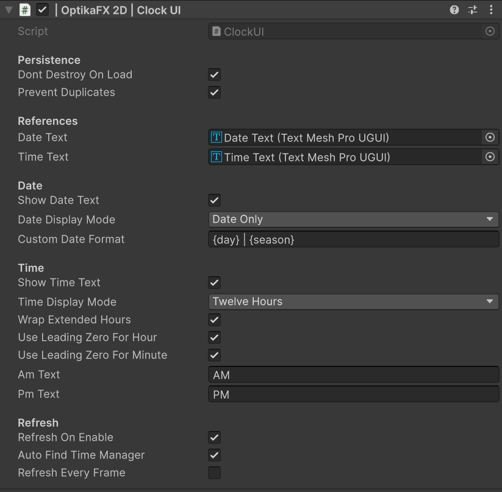


# Clock UI

The `ClockUI` component displays the current TimeManager date and time using TextMeshPro.

Clock UI is optional and only works when TextMeshPro is installed.

## Index

- [Overview](#overview)
- [Requirements](#requirements)
- [Creating Clock UI](#creating-clock-ui)
- [Prefab Template](#prefab-template)
- [Main Fields](#main-fields)
- [Date Display](#date-display)
- [Time Display](#time-display)
- [Persistence](#persistence)
- [Recommended Setup](#recommended-setup)
- [Useful C# Examples](#useful-c-examples)
  - [Refresh Clock UI](#refresh-clock-ui)
  - [Assign TimeManager from code](#assign-timemanager-from-code)
  - [Enable or disable Clock UI object](#enable-or-disable-clock-ui-object)
- [Troubleshooting](#troubleshooting)

---

## Overview



`ClockUI` is an optional UI component that displays information from the active `TimeManager`.

It can display:

- Current day
- Current season
- Current date
- Current time
- Custom date text

It automatically listens to TimeManager events and updates when time or date changes.

---

## Requirements

Clock UI requires:

- TextMeshPro
- A valid `TimeManager`
- Date and/or time TMP text references

If TextMeshPro is not installed, OptikaFX can ask for permission to install it from Unity Package Manager.

---

## Creating Clock UI

Select the `TimeManager` object.

Open the `Clock UI` section in the inspector.

Click:

    Create Clock UI Canvas

If TextMeshPro is not installed, click:

    Install TextMeshPro and Create Clock UI

After setup, OptikaFX will:

- Install TextMeshPro if needed
- Instantiate the Clock UI prefab
- Unpack the prefab automatically
- Connect it to the selected TimeManager
- Assign date and time text references when possible

---

## Prefab Template

OptikaFX uses a prefab template for Clock UI.

Default package prefab path:

    Packages/com.optikafx.2d/Runtime/UI/Prefabs/OptikaFX Clock UI.prefab

Optional user override path:

    Assets/OptikaFX 2D/Prefabs/UI/OptikaFX Clock UI.prefab

If both exist, the user prefab in `Assets` is preferred.

The prefab is unpacked automatically after creation, so the UI can be freely edited in the scene.

---

## Main Fields

Common ClockUI fields include:

| Field | Description |
|---|---|
| `Dont Destroy On Load` | Keeps the Clock UI when loading new scenes. |
| `Prevent Duplicates` | Prevents multiple persistent Clock UI instances. |
| `Time Manager` | TimeManager used as the data source. |
| `Date Text` | TMP text used to display date/day/season. |
| `Time Text` | TMP text used to display time. |
| `Show Date Text` | Enables or disables date text output. |
| `Date Display Mode` | Controls how date information is displayed. |
| `Custom Date Format` | Custom format used when Date Display Mode is Custom. |
| `Show Time Text` | Enables or disables time text output. |
| `Time Display Mode` | 12-hour or 24-hour display. |
| `Wrap Extended Hours` | Converts extended hours such as 27:45 into 03:45 visually. |
| `Refresh On Enable` | Refreshes the UI when enabled. |
| `Auto Find TimeManager` | Automatically uses `TimeManager.Instance`. |
| `Refresh Every Frame` | Refreshes UI every frame. Usually not needed. |

---

## Date Display

ClockUI can display date information in different modes:

| Mode | Description |
|---|---|
| `DateOnly` | Displays formatted date, such as `Day 01 - Spring`. |
| `DayOnly` | Displays only the day label and number. |
| `SeasonOnly` | Displays only the current season. |
| `Custom` | Uses a custom format string. |

Some modes may be reserved for future weather/calendar integrations.

---

## Custom Date Format

When `Date Display Mode` is set to `Custom`, use tokens:

| Token | Description |
|---|---|
| `{day}` | Current formatted day. |
| `{season}` | Current season display name. |

Example:

    {day} | {season}

Output:

    Day 01 | Spring

---

## Time Display

ClockUI supports:

| Mode | Description |
|---|---|
| `TwentyFourHours` | Displays time as `18:30`. |
| `TwelveHours` | Displays time as `06:30 PM`. |

Useful options:

| Field | Description |
|---|---|
| `Use Leading Zero For Hour` | Shows `06` instead of `6`. |
| `Use Leading Zero For Minute` | Shows `05` instead of `5`. |
| `AM Text` | Text used before noon. |
| `PM Text` | Text used after noon. |

---

## Extended Hours

If the TimeManager uses extended hours, values can go above 23.

Example:

    27:45

If `Wrap Extended Hours` is enabled, ClockUI displays:

    03:45

This is useful for games where the day only ends after sleeping.

---

## Persistence

ClockUI can persist between scenes using:

    Dont Destroy On Load

When enabled, the root Canvas object is preserved between scene loads.

If `Prevent Duplicates` is enabled, new Clock UI instances are destroyed automatically when a persistent one already exists.

Recommended for HUDs:

| Field | Suggested Value |
|---|---:|
| `Dont Destroy On Load` | Enabled |
| `Prevent Duplicates` | Enabled |
| `Auto Find TimeManager` | Enabled |
| `Refresh On Enable` | Enabled |
| `Refresh Every Frame` | Disabled |

---

## Recommended Setup

1. Select the `TimeManager` object.
2. Open the `Clock UI` section.
3. Click `Create Clock UI Canvas`.
4. If prompted, allow TextMeshPro installation.
5. Edit the created Canvas in the scene.
6. Make sure `Date Text` and `Time Text` are assigned.
7. Enter Play Mode and verify that the UI updates.

---

## Useful C# Examples

---

## Refresh Clock UI

```csharp
using UnityEngine;
using OptikaFX;

public class RefreshClockUIExample : MonoBehaviour
{
    [SerializeField]
    private ClockUI clockUI;

    public void Refresh()
    {
        if (clockUI == null)
            return;

        clockUI.Refresh();
    }
}

```

---

## Assign TimeManager from code

The `timeManager` field is private, so the recommended way is to enable `Auto Find TimeManager`.

If needed, call refresh after the TimeManager exists:

```csharp
using UnityEngine;
using OptikaFX;

public class ClockUIBindingExample : MonoBehaviour
{
    [SerializeField]
    private ClockUI clockUI;

    private void Start()
    {
        if (clockUI == null)
            return;

        clockUI.Refresh();
    }
}

```

---

## Enable or disable Clock UI object

```csharp
using UnityEngine;

public class ToggleClockUIObject : MonoBehaviour
{
    [SerializeField]
    private GameObject clockUIRoot;

    public void SetVisible(bool visible)
    {
        if (clockUIRoot == null)
            return;

        clockUIRoot.SetActive(visible);
    }
}

```

---

## Troubleshooting

### Clock UI does not appear

Check:

- TextMeshPro is installed.
- Clock UI Canvas exists in the scene.
- The Canvas is enabled.
- The TMP text objects are enabled.
- The Canvas sorting order is not behind other UI.

---

### Clock UI module is missing

Check:

- TextMeshPro is installed.
- Unity has finished compiling.
- Try reopening the TimeManager inspector.
- Try creating the Clock UI again.

---

### Date or time text is empty

Check:

- `TimeManager` exists.
- TimeManager component is enabled.
- `Date Text` is assigned.
- `Time Text` is assigned.
- `Show Date Text` and `Show Time Text` are enabled.

---

### Clock UI does not update

Check:

- `Auto Find TimeManager` is enabled.
- `TimeManager.Instance` exists.
- The ClockUI is subscribed to the active TimeManager.
- `Refresh On Enable` is enabled.
- Try calling `Refresh Clock UI` from the context menu.

---

### Clock UI duplicates after changing scenes

Enable:

- `Dont Destroy On Load`
- `Prevent Duplicates`

Make sure only one persistent Clock UI exists in the first loaded scene.

---

### Extended hours look wrong

If TimeManager uses hours above 23, enable:

    Wrap Extended Hours

Example:

    27:45

Displays as:

    03:45

---

← [Back to Documentation Index](index.md)
