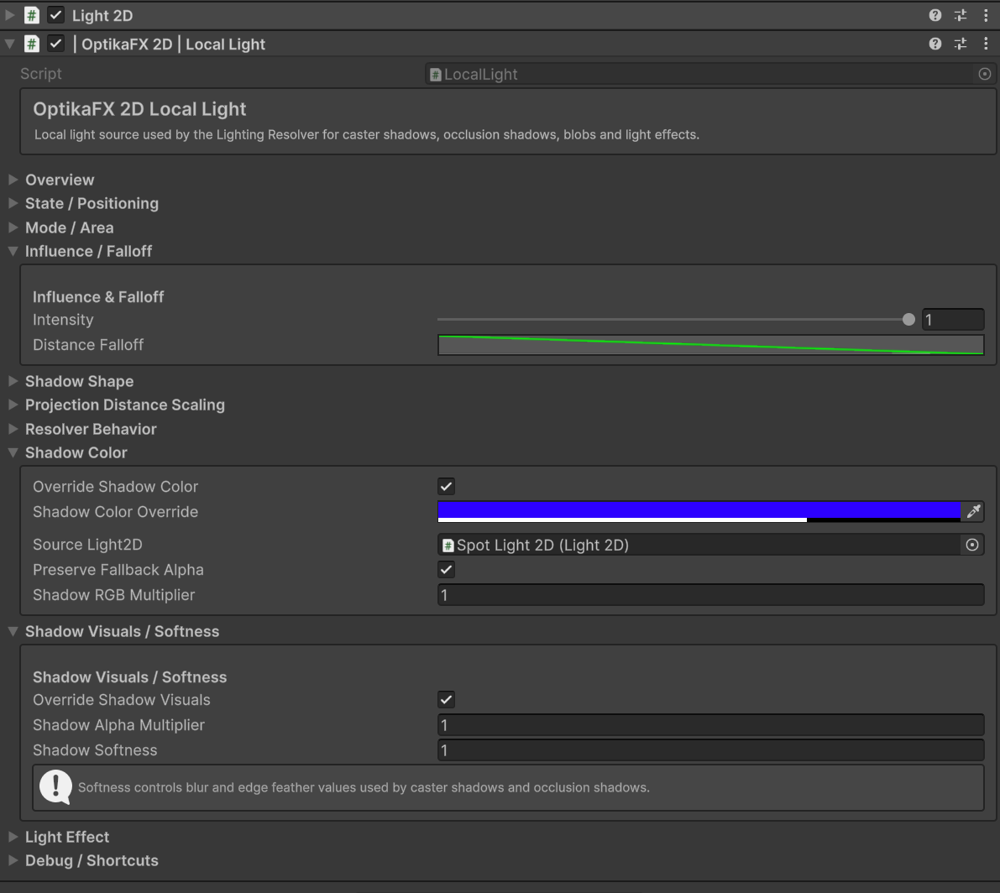
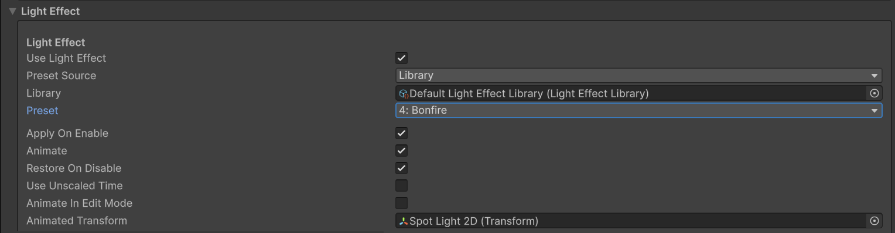


# Local Lights

The `LocalLight` component adds localized shadow and lighting influence to OptikaFX 2D.

Local Lights are useful for torches, lamps, candles, magic lights, street lights, windows, flashlights and other local light sources.

## Index

- [Overview](#overview)
- [When to Use Local Lights](#when-to-use-local-lights)
- [Local Light Modes](#local-light-modes)
- [Main Fields](#main-fields)
- [Global Blending](#global-blending)
- [Spot and Radial Lights](#spot-and-radial-lights)
- [Setup from Unity Light2D](#setup-from-unity-light2d)
- [Light Effects](#light-effects)
- [Common Light Effect Setups](#common-light-effect-setups)
- [Recommended Setup](#recommended-setup)
- [Useful C# Examples](#useful-c-examples)
  - [Get a LocalLight component](#get-a-locallight-component)
  - [Enable or disable a LocalLight](#enable-or-disable-a-locallight)
  - [Set local light range](#set-local-light-range)
  - [Set local light intensity](#set-local-light-intensity)
  - [Configure a radial local light](#configure-a-radial-local-light)
  - [Configure a spot local light](#configure-a-spot-local-light)
  - [Rotate a spot light](#rotate-a-spot-light)
  - [Use a transform as ground anchor](#use-a-transform-as-ground-anchor)
- [Troubleshooting](#troubleshooting)

---

## Overview

`LocalLight` allows individual scene lights to affect OptikaFX shadows.



A LocalLight can:

- Override global lighting in a local area
- Blend with global lighting
- Create local shadow direction
- Affect nearby casters
- Work as radial or spot light
- Use a Unity `Light2D` as a source
- Drive stylized light behavior through optional light effects

Local lights are typically used together with Unity 2D Light components.

---

## When to Use Local Lights

Use Local Lights for:

- Torches
- Lamps
- Candles
- Fireplaces
- Street lights
- Magic lights
- Flashlights
- Windows
- Small localized shadow effects

Use GlobalLight for:

- Sunlight
- Moonlight
- Main scene-wide shadow direction
- Day/night cycles

---

## Local Light Modes

LocalLight supports different behavior modes depending on your setup.

Common modes are:

| Mode | Description |
|---|---|
| `Radial` | Light spreads in all directions from a point. |
| `Spot` | Light projects in a directional cone. |

Radial lights are useful for lamps and torches.

Spot lights are useful for flashlights, windows and directional beams.

---

## Main Fields

Common LocalLight fields include:

| Field | Description |
|---|---|
| `Is Enabled` | Enables or disables the local light. |
| `Light Ground Anchor` | Transform used as the local light origin. |
| `Priority` | Used when multiple local lights affect the same caster. |
| `Intensity` | Strength of the local light influence. |
| `Range` | Maximum influence distance. |
| `Mode` | Radial or Spot mode. |
| `Spot Angle` | Cone angle for Spot mode. |
| `Rotation Angle` | Direction angle for Spot mode. |
| `Override Global` | Allows local light to override global lighting. |
| `Blend With Global` | Controls how much global light blends with local light. |
| `Override Shadow Color` | Lets the local light override shadow color. |
| `Override Shadow Visuals` | Lets the local light override softness/visual values. |
| `Projection Length` | Local projection length multiplier. |
| `Flatten` | Local flatten value. |

Names may vary depending on inspector version.

---

## Global Blending

Local lights can either override or blend with the GlobalLight.

Use:

    Override Global

when the local light should fully control shadows in its range.

Use:

    Blend With Global

when the local light should mix with the global direction and color.

Recommended values:

| Use Case | Override Global | Blend With Global |
|---|---:|---:|
| Torch | Enabled | 0.0 - 0.3 |
| Street Lamp | Enabled | 0.2 - 0.5 |
| Window Light | Enabled | 0.0 - 0.4 |
| Soft Ambient Light | Disabled | 0.5 - 1.0 |

---

## Spot and Radial Lights

### Radial

Radial mode uses the position of the local light as the origin.

Use it for:

- Lamps
- Torches
- Candles
- Fire

### Spot

Spot mode uses an angle and cone size.

Use it for:

- Flashlights
- Windows
- Directional beams
- Magic cones

---

## Setup from Unity Light2D

OptikaFX can configure local lights from existing Unity `Light2D` objects.

Use:

    OptikaFX 2D / Configure Lights

The setup detects Unity 2D lights and adds/configures `LocalLight` components where appropriate.

Global Unity lights are skipped or configured as Global Light.

---

## Light Effects

Light Effects are optional components or animations used to make local lights feel more dynamic.



They can be used to create:

- Flickering torches
- Pulsing magic lights
- Breathing lights
- Alarm lights
- Flashing lamps
- Random intensity variation
- Smooth range changes
- Rotating spotlights

Light Effects usually modify one or more of these values:

- Unity `Light2D` intensity
- Unity `Light2D` radius
- OptikaFX `LocalLight` intensity
- OptikaFX `LocalLight` range
- OptikaFX `LocalLight` rotation angle
- Shadow color
- Projection length

Light Effects are not required for Local Lights to work. They are used only to add animation or variation.

---

## Common Light Effect Setups

### Torch Flicker

Use for:

- Torches
- Fire
- Candles
- Campfires

Typical behavior:

- Small random intensity variation
- Small random range variation
- Warm color
- Radial local light

Recommended values:

| Field | Suggested Value |
|---|---:|
| `Mode` | `Radial` |
| `Intensity` | `0.8 - 1.0` |
| `Range` | `3 - 6` |
| `Blend With Global` | `0.0 - 0.3` |
| `Override Global` | Enabled |

---

### Magic Pulse

Use for:

- Magic crystals
- Spells
- Portals
- Glowing objects

Typical behavior:

- Smooth sine wave intensity
- Smooth range pulse
- Colored light
- Optional shadow color override

Recommended values:

| Field | Suggested Value |
|---|---:|
| `Mode` | `Radial` |
| `Intensity` | `0.5 - 1.0` |
| `Range` | `4 - 8` |
| `Blend With Global` | `0.2 - 0.5` |
| `Override Shadow Color` | Optional |

---

### Flashlight

Use for:

- Player flashlight
- Searchlights
- Cone lights
- Directional effects

Typical behavior:

- Spot mode
- Follows player direction
- Optional small flicker
- Strong local override

Recommended values:

| Field | Suggested Value |
|---|---:|
| `Mode` | `Spot` |
| `Spot Angle` | `30 - 60` |
| `Range` | `6 - 12` |
| `Intensity` | `0.8 - 1.0` |
| `Override Global` | Enabled |
| `Blend With Global` | `0.0 - 0.2` |

---

### Alarm Light

Use for:

- Sirens
- Warning lights
- Security lights

Typical behavior:

- Repeated intensity pulse
- Optional color change
- Optional rotating spot angle

Recommended values:

| Field | Suggested Value |
|---|---:|
| `Mode` | `Spot` or `Radial` |
| `Intensity` | Animated |
| `Range` | `5 - 10` |
| `Rotation Angle` | Animated if Spot |
| `Override Shadow Color` | Optional |

---

## Recommended Setup

1. Create or select a Unity `Light2D`.
2. Run:

    OptikaFX 2D / Configure Lights

3. Select the light object.
4. Confirm it has a `LocalLight` component.
5. Adjust `Range`, `Intensity`, `Mode` and `Blend With Global`.
6. Add a Light Effect if you want flicker, pulse or animation.

For torches and lamps, start with:

| Field | Suggested Value |
|---|---:|
| `Mode` | `Radial` |
| `Range` | `4 - 6` |
| `Intensity` | `0.8 - 1.0` |
| `Override Global` | Enabled |
| `Blend With Global` | `0.2` |

For flashlights, start with:

| Field | Suggested Value |
|---|---:|
| `Mode` | `Spot` |
| `Spot Angle` | `45` |
| `Range` | `8` |
| `Intensity` | `1.0` |
| `Override Global` | Enabled |
| `Blend With Global` | `0.1` |

---

## Useful C# Examples

---

## Get a LocalLight component
```csharp
using UnityEngine;
using OptikaFX;

public class LocalLightExample : MonoBehaviour
{
    private LocalLight localLight;

    private void Awake()
    {
        localLight = GetComponent<LocalLight>();
    }
}

```
---

## Enable or disable a LocalLight
```csharp
using UnityEngine;
using OptikaFX;

public class ToggleLocalLight : MonoBehaviour
{
    [SerializeField]
    private LocalLight localLight;

    public void SetLightEnabled(bool enabled)
    {
        if (localLight == null)
            return;

        localLight.isEnabled = enabled;
    }
}

```
---

## Set local light range
```csharp
using UnityEngine;
using OptikaFX;

public class LocalLightRangeExample : MonoBehaviour
{
    [SerializeField]
    private LocalLight localLight;

    public void SetRange(float range)
    {
        if (localLight == null)
            return;

        localLight.range = Mathf.Max(0.01f, range);
    }
}

```
---

## Set local light intensity
```csharp
using UnityEngine;
using OptikaFX;

public class LocalLightIntensityExample : MonoBehaviour
{
    [SerializeField]
    private LocalLight localLight;

    public void SetIntensity(float intensity)
    {
        if (localLight == null)
            return;

        localLight.intensity = Mathf.Clamp01(intensity);
    }
}

```
---

## Configure a radial local light
```csharp
using UnityEngine;
using OptikaFX;

public class ConfigureRadialLocalLight : MonoBehaviour
{
    [SerializeField]
    private LocalLight localLight;

    private void Start()
    {
        if (localLight == null)
            localLight = GetComponent<LocalLight>();

        if (localLight == null)
            return;

        localLight.isEnabled = true;
        localLight.mode = LocalLight.LocalLightMode.Radial;
        localLight.range = 5f;
        localLight.intensity = 1f;
        localLight.overrideGlobal = true;
        localLight.blendWithGlobal = 0.2f;
    }
}

```
---

## Configure a spot local light
```csharp
using UnityEngine;
using OptikaFX;

public class ConfigureSpotLocalLight : MonoBehaviour
{
    [SerializeField]
    private LocalLight localLight;

    private void Start()
    {
        if (localLight == null)
            localLight = GetComponent<LocalLight>();

        if (localLight == null)
            return;

        localLight.isEnabled = true;
        localLight.mode = LocalLight.LocalLightMode.Spot;
        localLight.range = 7f;
        localLight.intensity = 1f;
        localLight.spotAngle = 45f;
        localLight.rotationAngle = 270f;
        localLight.overrideGlobal = true;
        localLight.blendWithGlobal = 0.1f;
    }
}

```
---

## Rotate a spot light
```csharp
using UnityEngine;
using OptikaFX;

public class RotateSpotLocalLight : MonoBehaviour
{
    [SerializeField]
    private LocalLight localLight;

    [SerializeField]
    private float rotationSpeed = 90f;

    private void Update()
    {
        if (localLight == null)
            return;

        if (localLight.mode != LocalLight.LocalLightMode.Spot)
            return;

        localLight.rotationAngle += rotationSpeed * Time.deltaTime;

        localLight.rotationAngle = Mathf.Repeat(localLight.rotationAngle, 360f);
    }
}

```
---

## Use a transform as ground anchor
```csharp
using UnityEngine;
using OptikaFX;

public class LocalLightAnchorExample : MonoBehaviour
{
    [SerializeField]
    private LocalLight localLight;

    [SerializeField]
    private Transform anchor;

    private void Start()
    {
        if (localLight == null)
            localLight = GetComponent<LocalLight>();

        if (localLight == null)
            return;

        localLight.lightGroundAnchor = anchor != null ? anchor : transform;
    }
}

```
---

## Troubleshooting

### Local Light does not affect shadows

Check:

- The object has a `LocalLight` component.
- `Is Enabled` is true.
- `Range` is large enough.
- The caster is inside the local light range.
- The caster allows local light influence.
- The local light has enough priority if multiple lights overlap.

### Local Light feels too strong

Adjust:

- `Intensity`
- `Blend With Global`
- `Projection Length`
- `Override Shadow Color`
- `Override Shadow Visuals`

### Spot light points in the wrong direction

Adjust:

- `Rotation Angle`
- The transform rotation
- The configured `Spot Angle`

### Light Effect does not animate

Check:

- The Light Effect component is enabled.
- The object has a valid `LocalLight`.
- The object has a valid Unity `Light2D` if the effect controls Unity light values.
- The effect intensity/range values are not zero.

### Local Light does not follow Unity Light2D

Run:

    OptikaFX 2D / Configure Lights

Then check that the `LocalLight` component was added to the same GameObject as the Unity `Light2D`.


← [Back to Documentation Index](index.md)
