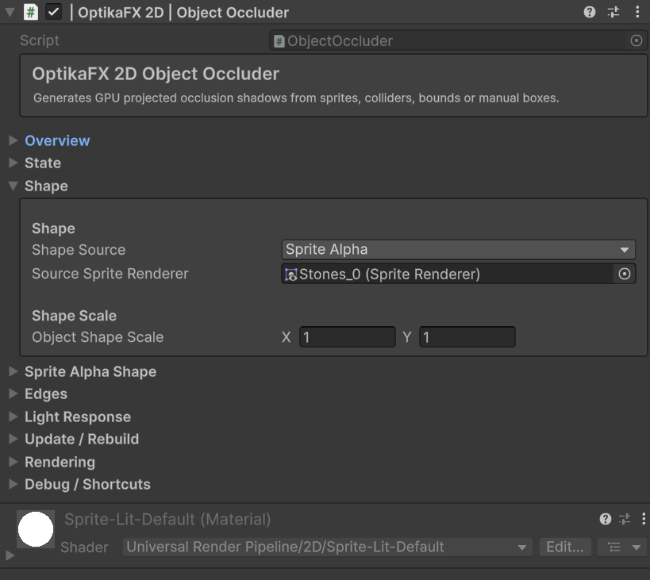
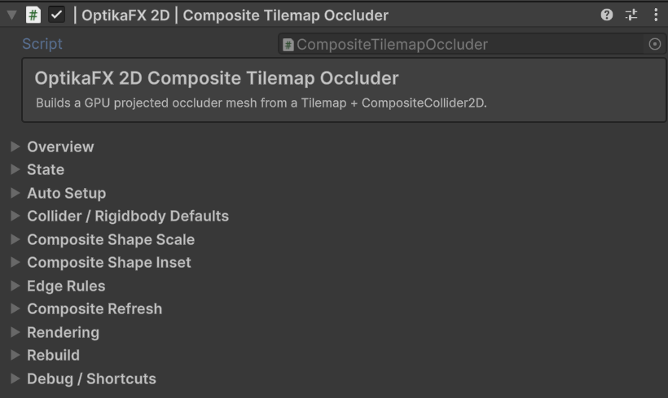

# Occluders

Occluders are used by OptikaFX 2D to generate shadow masks from objects or tilemaps.

They are useful for environment shadows, directional occlusion, solid obstacles and tilemap-based silhouettes.

## Index

- [Overview](#overview)
- [When to Use Occluders](#when-to-use-occluders)
- [Object Occluder](#object-occluder)
- [Composite Tilemap Occluder](#composite-tilemap-occluder)
- [Main Fields](#main-fields)
- [Object Occluder Fields](#object-occluder-fields)
- [Tilemap Occluder Fields](#tilemap-occluder-fields)
- [Recommended Setup](#recommended-setup)
- [Useful C# Examples](#useful-c-examples)
  - [Get an ObjectOccluder](#get-an-objectoccluder)
  - [Enable or disable an ObjectOccluder](#enable-or-disable-an-objectoccluder)
  - [Set occluder projection length](#set-occluder-projection-length)
  - [Set occluder alpha](#set-occluder-alpha)
  - [Rebuild a CompositeTilemapOccluder](#rebuild-a-compositetilemapoccluder)
- [Troubleshooting](#troubleshooting)

---

## Overview

Occluders create shadow masks from object silhouettes or tilemap geometry.

They are different from Casters:

- A `Caster` usually generates character/object projected shadows.
- An `Occluder` usually generates environment or obstacle shadows.

Common use cases:

- Walls
- Buildings
- Rocks
- Tilemap silhouettes

**Occluders are not compatible with Wall Bending.**

---

## When to Use Occluders

Use occluders when an object should block or project environmental shadows.

Use them for:

- Static props
- Solid structures
- Tilemap walls
- Occluding terrain
- Large environment shapes
- Objects that do not need full caster behavior

Use a normal `Caster` when the object needs character-like projected or animated shadows.

---

## Object Occluder



`ObjectOccluder` is used for individual GameObjects, usually with a `SpriteRenderer`.

It can use the sprite silhouette to generate a directional projected mask.

Recommended for:

- Single rocks
- Trees
- Buildings
- Props
- Static sprites
- Invisible occlusion objects

Setup menu:

    OptikaFX 2D / Add Casters and Receivers / Add Casters to Selected Game Objects / Occluder

---

## Composite Tilemap Occluder



`CompositeTilemapOccluder` is used for Tilemaps.

It builds a combined occlusion topology from tilemap collider geometry.

Recommended for:

- Tilemap walls
- Tilemap cliffs
- Tilemap buildings
- Large level geometry
- Grid-based occlusion

Setup menu:

    OptikaFX 2D / Add Casters and Receivers / Add Casters to Selected Tilemaps / Composite Occluder

The setup can automatically add/configure:

- `TilemapCollider2D`
- `Rigidbody2D`
- `CompositeCollider2D`
- `CompositeTilemapOccluder`

---

## Main Fields

Common occluder fields include:

| Field | Description |
|---|---|
| `Is Enabled` | Enables or disables the occluder. |
| `Elevation Level` | Elevation layer used by the occlusion/shadow system. |
| `Max Lights To Render` | Maximum number of lights affecting the occluder. |
| `Alpha Threshold` | Alpha cutoff used when extracting sprite silhouettes. |
| `Mask Alpha Multiplier` | Multiplies occluder mask opacity. |
| `Projection Length Multiplier` | Controls occluder shadow projection length. |
| `Alpha Multiplier` | Multiplies final projected occluder alpha. |
| `Source Sprite Renderer` | SpriteRenderer used as silhouette source. |

---
Names may vary depending on inspector version.

---

## Object Occluder Fields

Important fields for `ObjectOccluder`:

| Field | Description |
|---|---|
| `Source Sprite Renderer` | SpriteRenderer used to generate the silhouette. |
| `Alpha Threshold` | Ignores pixels below this alpha value. |
| `Projection Length Multiplier` | Controls how far the occluder shadow projects. |
| `Mask Alpha Multiplier` | Controls mask strength. |
| `Max Lights To Render` | Limits local light contribution. |
| `Elevation Level` | Determines which elevation layer the occluder belongs to. |

Recommended starting values:

| Field | Suggested Value |
|---|---:|
| `Alpha Threshold` | `0.05` |
| `Projection Length Multiplier` | `1.0` |
| `Mask Alpha Multiplier` | `1.0` |
| `Alpha Multiplier` | `1.0` |
| `Max Lights To Render` | `2` |

---

## Tilemap Occluder Fields

Important fields for `CompositeTilemapOccluder`:

| Field | Description |
|---|---|
| `Is Enabled` | Enables or disables the tilemap occluder. |
| `Auto Configure Composite Setup` | Automatically configures collider/composite requirements. |
| `Rebuild Every Frame` | Rebuilds topology every frame. Useful only for dynamic tilemaps. |
| `Runtime Refresh Composite When Rebuilding` | Refreshes composite collider during rebuild. |
| `Composite Shape Scale` | Scales generated composite shapes. |

For static tilemaps, keep:

| Field | Suggested Value |
|---|---:|
| `Rebuild Every Frame` | Disabled |
| `Auto Configure Composite Setup` | Enabled |
| `Runtime Refresh Composite When Rebuilding` | Disabled |

---

## Recommended Setup

### Object Occluder

1. Select a GameObject with a SpriteRenderer.
2. Right-click in the Hierarchy.
3. Choose:

    OptikaFX 2D / Add Casters To Selected GameObjects / Occluder

4. Confirm that `ObjectOccluder` was added.
5. Check that `Source Sprite Renderer` is assigned.
6. Adjust, scale, alpha threshold and projection length.

### Tilemap Occluder

1. Select a Tilemap.
2. Right-click in the Hierarchy.
3. Choose:

    OptikaFX 2D / Add Casters To Selected Tilemaps / Composite Occluder

4. Confirm that `CompositeTilemapOccluder` was added.
5. Confirm that required collider components exist.
6. Rebuild topology if needed.

---

## Useful C# Examples

---

## Get an ObjectOccluder
```csharp 
using UnityEngine;
using OptikaFX;

public class ObjectOccluderExample : MonoBehaviour
{
    private ObjectOccluder occluder;

    private void Awake()
    {
        occluder = GetComponent<ObjectOccluder>();
    }
}

```
---

## Enable or disable an ObjectOccluder
```csharp 
using UnityEngine;
using OptikaFX;

public class ToggleObjectOccluder : MonoBehaviour
{
    [SerializeField]
    private ObjectOccluder occluder;

    public void SetEnabled(bool enabled)
    {
        if (occluder == null)
            return;

        occluder.isEnabled = enabled;
    }
}

```
---

## Set occluder projection length
```csharp 
using UnityEngine;
using OptikaFX;

public class OccluderProjectionExample : MonoBehaviour
{
    [SerializeField]
    private ObjectOccluder occluder;

    public void SetProjectionLength(float length)
    {
        if (occluder == null)
            return;

        occluder.projectionLengthMultiplier = Mathf.Max(0f, length);
    }
}

```
---

## Set occluder alpha
```csharp 
using UnityEngine;
using OptikaFX;

public class OccluderAlphaExample : MonoBehaviour
{
    [SerializeField]
    private ObjectOccluder occluder;

    public void SetAlpha(float alpha)
    {
        if (occluder == null)
            return;

        occluder.alphaMultiplier = Mathf.Max(0f, alpha);
    }
}

``` 
---

## Rebuild a CompositeTilemapOccluder
```csharp 
using UnityEngine;
using OptikaFX;

public class RebuildTilemapOccluderExample : MonoBehaviour
{
    [SerializeField]
    private CompositeTilemapOccluder tilemapOccluder;

    public void Rebuild()
    {
        if (tilemapOccluder == null)
            return;

        tilemapOccluder.RebuildTopology(true);
    }
}

```
---

## Troubleshooting

### Object Occluder does not generate shadow

Check:

- The object has an `ObjectOccluder` component.
- `Is Enabled` is true.
- `Source Sprite Renderer` is assigned.
- The SpriteRenderer has a valid sprite.
- The sprite has enough alpha above `Alpha Threshold`.
- The occlusion render feature is installed.
- Global or local lights exist.

### Tilemap Occluder does not work

Check:

- The object has a `CompositeTilemapOccluder`.
- The object has a `Tilemap`.
- `TilemapCollider2D` exists.
- `CompositeCollider2D` exists.
- `Rigidbody2D` exists and is Static.
- The tilemap has tiles.
- Topology was rebuilt.

### Tilemap occlusion is outdated

If the tilemap changes at runtime, rebuild the topology:

    tilemapOccluder.RebuildTopology(true);

For dynamic tilemaps, enable:

- `Rebuild Every Frame`
- `Runtime Refresh Composite When Rebuilding`

Only enable these if needed, because they can be more expensive.

### Occluder shape is too large or too small

Adjust:

- `Composite Shape Scale`
- Sprite import settings
- Sprite pivot
- Transform scale
- Projection length multiplier

### Occluder shadow is too weak or invisible

Adjust:

- `Mask Alpha Multiplier`
- `Alpha Multiplier`
- `Alpha Threshold`
- GlobalLight intensity
- LocalLight intensity
- Shadow color alpha

### Occluder affects the wrong elevation

Check:

- `Elevation Level`
- Receiver elevation level
- ShadowRenderQuad elevation level
- Area/mask rules

← [Back to Documentation Index](index.md)
