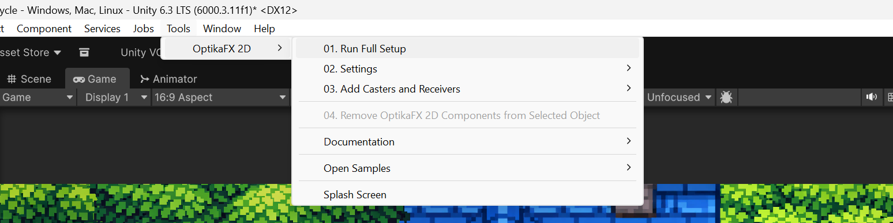
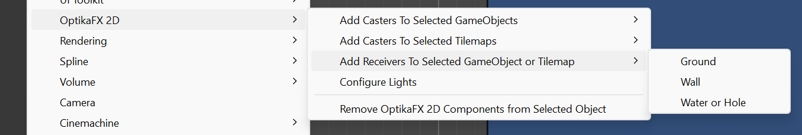
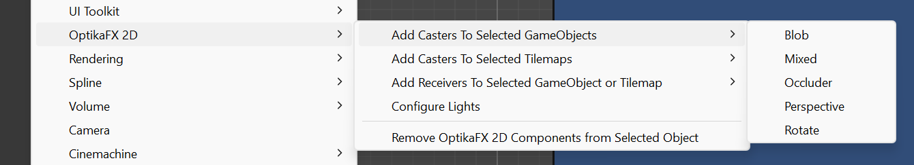
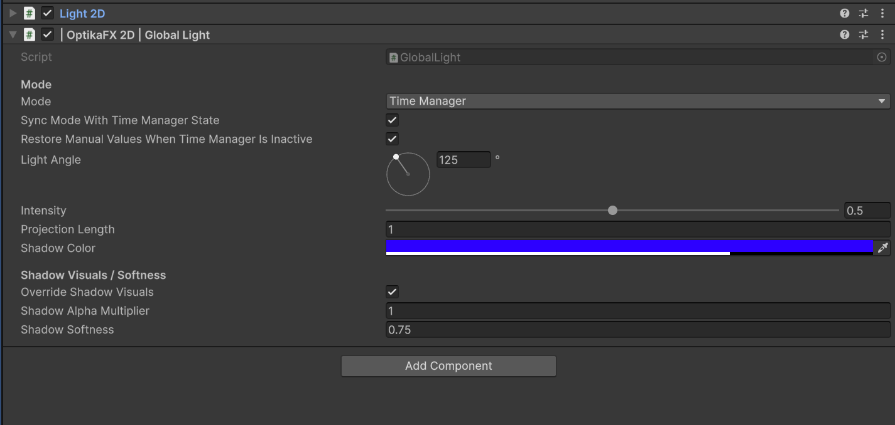
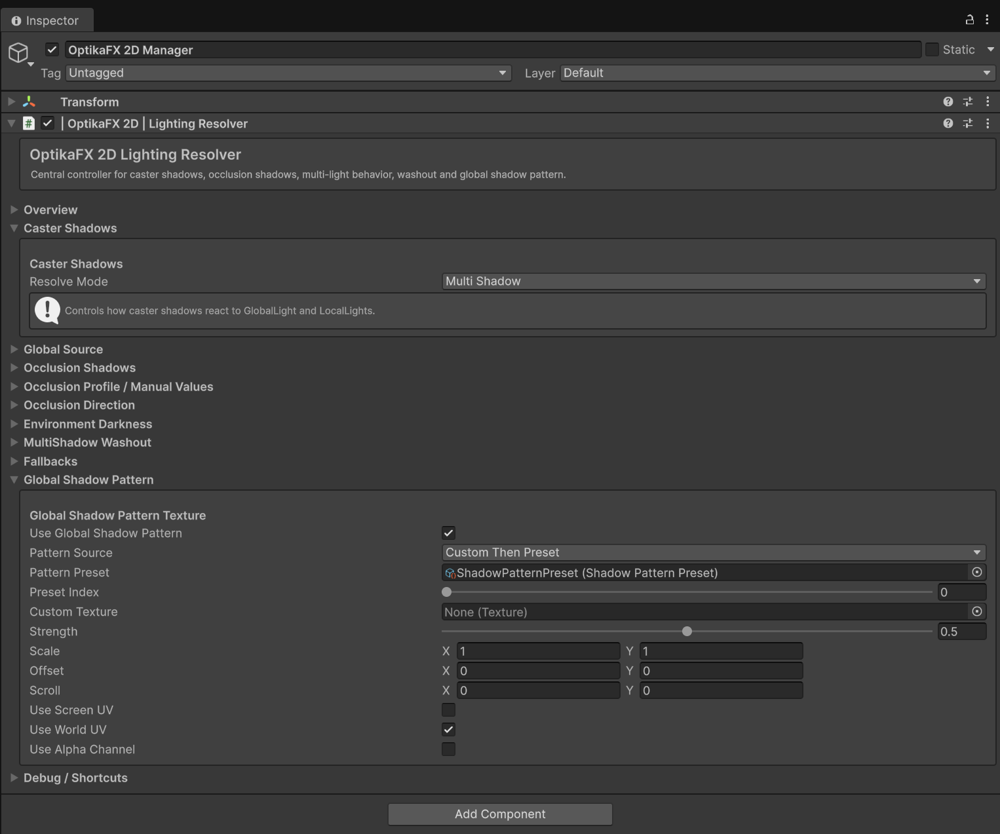
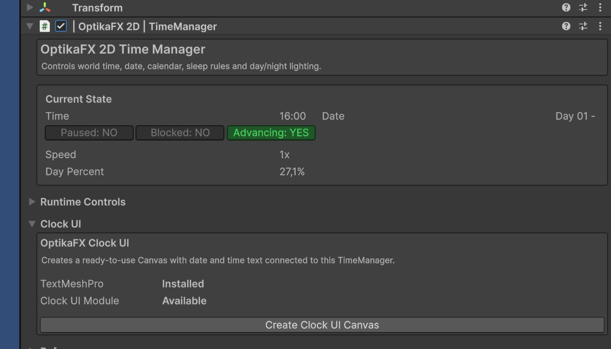
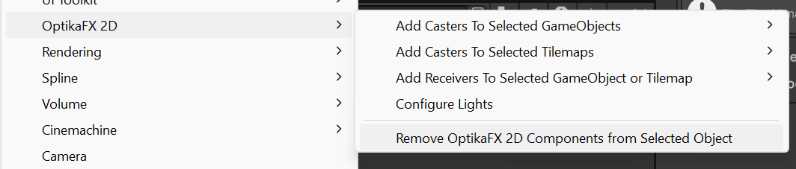

# Quick Start

This guide shows the fastest way to get OptikaFX 2D running in a scene.

---

Optional guided tutorial:

Open the sample scene:

```text 
01 - Scarecrow Tutorial
```

When this scene is opened, the Scarecrow Tutorial window appears automatically and guides you through the basic OptikaFX setup step by step.

Tutorial guide:

- [Scarecrow Tutorial](Documentation~/scarecrow-tutorial.md)

---

## Step-by-step Setup

### Before starting, remember to always use the sprite pivot at the bottom center or right between the character's feet.

## 1. Run Full Setup

Use:

```text
Tools / OptikaFX 2D / 01. Run Full Setup
```




This prepares the project and scene by:

- Configuring URP
- Adding required render features
- Creating required layers
- Configuring the active camera
- Creating the `OptikaFX 2D Manager`
- Creating `Global Light`
- Creating `TimeManager`
- Adding the `LightResolver`
- Assigning materials and presets
- Copying day/night lighting presets

After setup, your scene should contain:

```text
OptikaFX 2D Manager
├── Global Light
└── TimeManager
```

The `LightResolver` is added as a component on the `OptikaFX 2D Manager`.

See:

- [Camera](camera.md)
- [Global Light](global-light.md)
- [Light Resolver](light-resolver.md)
- [TimeManager](time-manager.md)

---

## 2. Add Receivers

Receivers define where shadows can appear.

Select the GameObject or Tilemap that should receive shadows, then use the OptikaFX receiver menu.



Common receiver types:

- Ground
- Wall
- Water or Hole
- Tilemap receivers

See:

- [Receivers](receivers.md)
- [Wall Bending](wall-bending.md)
- [Camera](camera.md)

---

## 3. Add Casters

Casters generate shadows from SpriteRenderer objects.

Select a GameObject and add a caster mode:

- Perspective
- Rotation
- Mixed
- Blob
- Occluder



Recommended usage:

| Mode | Use |
|---|---|
| `Perspective` | Classic projected ground shadows |
| `Rotation` | Compact stylized shadows |
| `Mixed` | Characters and directional sprites |
| `Blob` | Simple top-down contact shadows |
| `Occluder` | Environment occlusion silhouettes |

See:

- [Casters](casters.md)
- [Animator Blend Tree Setup](animator-blend-tree-setup.md)
- [Horizontal Proxy](horizontal-proxy.md)
- [Occluders](occluders.md)

---

## 4. Configure Lighting

Use `Global Light` for scene-wide shadows.



Use `Local Light` for localized lights such as:

- Torches
- Lamps
- Candles
- Street lights
- Flashlights
- Windows

Use the `LightResolver` to control:

- Shadow resolve modes
- MultiShadow
- VectorBlend
- Washout
- Occlusion resolving
- Shadow pattern textures




See:

- [Global Light](global-light.md)
- [Local Light](local-light.md)
- [Light Resolver](light-resolver.md)

---

## 5. Configure Camera

Full Setup adds `ShadowRenderQuad` to the active camera.

Check that your main camera has:

- `Camera`
- `ShadowRenderQuad`

`ShadowRenderQuad` draws the final shadow layer using shadow mattes.


If shadows are missing or sorted incorrectly, check:

- Quad Material
- Sorting Layer
- Sorting Order
- Enabled shadow mattes
- Required Area rules

See:

- [Camera](camera.md)
- [Receivers](receivers.md)
- [Troubleshooting](troubleshooting.md)

---

## 6. Optional: Enable TimeManager

`TimeManager` controls:

- In-game time
- Date
- Seasons
- Sleep rules
- Day/night lighting
- Lighting presets

By default, the `TimeManager` object is active, but the `TimeManager` component starts disabled.

Enable it only if you want day/night lighting to control the `Global Light`.

See:

- [TimeManager](time-manager.md)
- [Global Light](global-light.md)

---

## 7. Optional: Create Clock UI

Clock UI is optional and requires TextMeshPro.

Use the `TimeManager` inspector:

```text
Clock UI / Create Clock UI Canvas
```



See:

- [Clock UI](clock-ui.md)
- [Optional Modules](optional-modules.md)

---

## 8. Optional: Add Occluders

Occluders create environment occlusion and silhouette-based masks.

Use occluders for:

- Static obstacles
- Buildings
- Rocks
- Tilemap silhouettes
- Environment shadows

Important:

- Occluders are not compatible with Wall Bending.
- Use a `Caster` if you need shadows to bend onto walls.

See:

- [Occluders](occluders.md)
- [Wall Bending](wall-bending.md)

---

## 9. Test

Enter Play Mode and check:

- Casters generate shadows
- Receivers display shadows
- Global Light affects shadow direction
- Local Lights affect shadows if configured
- Light Resolver settings produce the expected result
- Camera `ShadowRenderQuad` draws shadows
- Sorting Layer and Sorting Order are correct

If something does not work, see:

- [Troubleshooting](troubleshooting.md)

---

## 10. Remove OptikaFX Components

To remove OptikaFX components from selected objects:

```text
GameObject / OptikaFX 2D / Remove OptikaFX 2D Components from Selected Object
```


This keeps native Unity components such as:

- Transform
- SpriteRenderer
- Tilemap
- Camera
- Light2D

See:

- [Troubleshooting](troubleshooting.md)

---

← [Back to Documentation Index](index.md)
