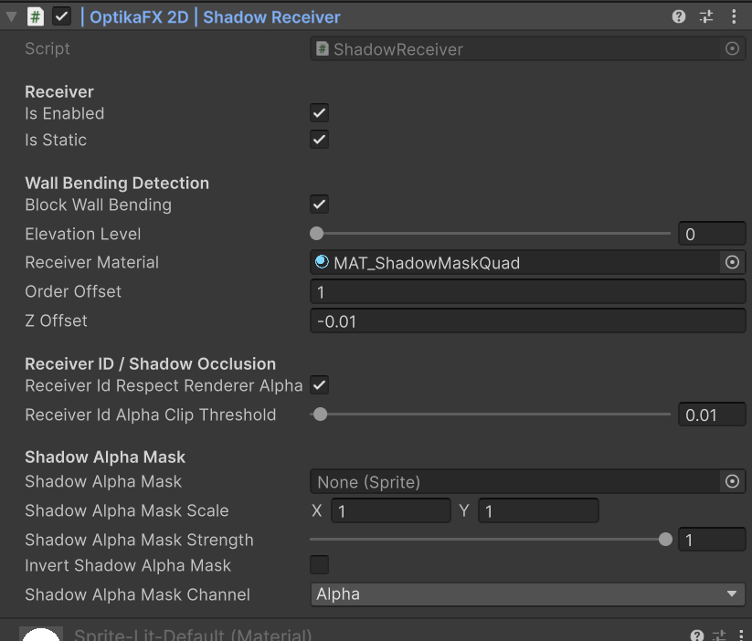

# Receivers and Shadow Areas

Receivers and Shadow Areas define where OptikaFX 2D shadows can appear.

A `Receiver` is the surface that displays shadows.

A `ShadowArea` defines what kind of area the object represents, such as ground, wall, water or hole.

## Index

- [Overview](#overview)
- [Receivers](#receivers)
- [Shadow Areas](#shadow-areas)
- [Receiver Types](#receiver-types)
- [Area Types](#area-types)
- [Ground Receivers](#ground-receivers)
- [Wall Receivers](#wall-receivers)
- [Hybrid Receivers](#hybrid-receivers)
- [Water and Hole Areas](#water-and-hole-areas)
- [Tilemap Receivers](#tilemap-receivers)
- [Receiver Material](#receiver-material)
- [Wall ID](#wall-id)
- [Elevation Level](#elevation-level)
- [Shadow Alpha Mask](#shadow-alpha-mask)
- [Recommended Setup](#recommended-setup)
- [Useful C# Examples](#useful-c-examples)
  - [Get a ShadowReceiver](#get-a-shadowreceiver)
  - [Enable or disable a receiver](#enable-or-disable-a-receiver)
  - [Set receiver material](#set-receiver-material)
  - [Set elevation level](#set-elevation-level)
  - [Set ShadowArea type](#set-shadowarea-type)
  - [Set ShadowReceiver surface mode](#set-shadowreceiver-surface-mode)
- [Troubleshooting](#troubleshooting)

---

## Overview

OptikaFX uses receivers to display shadows on specific surfaces.

Examples:

- Ground
- Walls
- Tilemaps
- Floors
- Platforms
- Special shadow surfaces

Shadow Areas are used to classify these surfaces.

For example:

- Ground receives normal ground shadows.
- Walls receive wall bending/projected wall shadows.
- Water or holes can block or mask shadows.

---

## Receivers



Receivers are components that render shadow information onto an object.

Main receiver components:

| Component | Use |
|---|---|
| `ShadowReceiver` | Used for SpriteRenderer/MeshRenderer based objects. |
| `TilemapShadowReceiver` | Used for Tilemap based receivers. |

Receivers are usually added through the OptikaFX setup menu.

---

## Shadow Areas

`ShadowArea` defines what type of area an object represents.

It does not render the shadow by itself. It provides area information used by shadow mask rules.

ShadowArea types include:

| Type | Description |
|---|---|
| `Ground_Red` | Ground/floor area. |
| `Wall_Green` | Wall/vertical area. |
| `Hole_Water_Blue` | Blocks or masks shadows, usually holes or water. |
| `Special_Alpha` | Reserved for special/custom area behavior. |

---

## Receiver Types

OptikaFX supports:

| Receiver | Description |
|---|---|
| `ShadowReceiver` | Used for normal GameObjects with renderers. |
| `TilemapShadowReceiver` | Used for Unity Tilemaps. |

Use `ShadowReceiver` for:

- Sprite objects
- MeshRenderer objects
- Wall sprites
- Ground sprites
- Custom surface objects

Use `TilemapShadowReceiver` for:

- Ground tilemaps
- Wall tilemaps
- Floor tilemaps
- Large tile-based maps

---

## Area Types

Area types determine how shadows interact with the surface.

| Area | Color Channel | Common Use |
|---|---|---|
| Ground | Red | Floors, ground, walkable surfaces |
| Wall | Green | Walls, cliffs, vertical surfaces |
| Water/Hole | Blue | Holes, water, blocked areas |
| Special | Alpha | Custom rules or special masks |

These color associations are used internally by the mask system.

---

## Ground Receivers

Ground receivers are used for normal floor shadows.

Use them for:

- Terrain
- Floors
- Platforms
- Ground tilemaps
- Walkable surfaces

Setup:

    OptikaFX 2D / Add Receivers To Selected GameObject or Tilemap / Ground

This usually adds/configures:

- `ShadowArea`
- Area type as Ground
- Receiver rules for ground shadows

---

## Wall Receivers

Wall receivers are used for wall shadows and wall bending.

Use them for:

- Walls
- Cliffs
- Vertical surfaces
- Building sides
- Tilemap walls

Setup:

    OptikaFX 2D / Add Receivers To Selected GameObject or Tilemap / Wall

This usually adds/configures:

- `ShadowArea`
- `ShadowReceiver` or `TilemapShadowReceiver`
- Area type as Wall
- Unique Wall ID

Wall receivers are required for Caster Wall Bending.

---

## Hybrid Receivers

Hybrid mode is available on `ShadowReceiver`.

It is used when one sprite/object needs to behave partly as ground and partly as wall.

This is useful for objects such as:

- Stairs
- Ramps
- Cliff edges
- Isometric wall/floor sprites
- Large environment sprites that contain both walkable ground and vertical wall parts
- Sprites where only a specific collider region should act as the wall

### Surface Mode

`ShadowReceiver` has a `Surface Mode` setting:

| Mode | Description |
|---|---|
| `Wall` | The whole receiver behaves as a wall. |
| `Hybrid` | Collider-covered areas behave as wall. Non-collider receiver areas behave as ground. |

Default behavior is `Wall`.

Use `Hybrid` when a single rendered object contains both ground and wall regions.

---

### How Hybrid Mode Works

In Hybrid mode:

- The visible receiver still displays shadows.
- Collider mask areas are treated as wall.
- Areas outside the collider mask are treated as ground.
- The receiver can still participate in Wall Bending.
- The receiver uses its `Wall ID` for wall ownership.
- Transparent pixels are respected for Receiver ID writing.

This allows a shadow to behave like a ground shadow on part of the sprite and like a wall shadow on another part of the same sprite.

Example:

A stair sprite may include:

- Lower floor area
- Stair ramp area
- Back wall edge

With Hybrid mode, the receiver can treat the collider-covered wall area as wall while still allowing the rest of the sprite to receive ground shadows.

---

### Hybrid Wall Mask Colliders

Hybrid mode uses `Collider2D` components as the wall mask.

Fields:

| Field | Description |
|---|---|
| `Hybrid Auto Find Wall Mask Colliders` | If enabled, Hybrid mode automatically uses `Collider2D` components in this hierarchy as the wall mask. |
| `Hybrid Wall Mask Colliders` | Optional explicit list of colliders used as the wall mask. |
| `Hybrid Fallback To Wall If No Mask` | If enabled and no valid mask exists, the receiver falls back to normal Wall behavior. |

The wall mask defines which parts of the receiver count as wall.

Areas covered by the Hybrid wall mask colliders behave as wall.

Areas not covered by those colliders behave as ground.

---

### Recommended Hybrid Setup

Use Hybrid mode when a single object visually contains both wall and ground.

Recommended setup:

1. Select the object with the sprite/renderer.
2. Add or confirm a `ShadowReceiver`.
3. Set:

    Surface Mode: Hybrid

4. Add one or more `Collider2D` components to define the wall region.
5. Enable:

    Hybrid Auto Find Wall Mask Colliders

   or manually assign colliders to:

    Hybrid Wall Mask Colliders

6. Make sure the receiver has a valid `Wall ID`.
7. Enable `Block Wall Bending` if the receiver should be detected by Caster wall-bending raycasts.

---

### Hybrid Ground Ownership

Hybrid receivers include an optional setting:

    Hybrid Ground Owner Look Ahead World

This value allows Casters to detect the Hybrid receiver slightly before the projected shadow physically reaches the wall collider.

This is useful when a sprite contains transitional areas such as:

- Stairs before a wall
- Ramps before a cliff
- Ground leading into a vertical surface
- Isometric tiles where the ground and wall are part of the same sprite

Without look-ahead, a ground shadow may pop or switch ownership too late when approaching the wall area.

Use a small value first, for example:

    Hybrid Ground Owner Look Ahead World: 0.05

Increase only if needed.

Recommended values:

| Situation | Suggested Value |
|---|---|
| No popping | `0` |
| Small stair/ramp transition | `0.03` to `0.08` |
| Larger isometric transition area | `0.08` to `0.2` |

Avoid very large values unless the receiver is designed to take ownership from far away.

---

### Hybrid and Alpha

Hybrid receivers automatically respect renderer alpha for Receiver ID behavior.

This means transparent pixels do not write receiver ownership.

This is important for sprites with:

- Alpha cutouts
- Irregular edges
- Holes
- Decorative transparent regions
- Non-rectangular silhouettes

For `ShadowReceiver`, when Hybrid mode is active, `ReceiverIdRespectRendererAlpha` behaves as enabled.

If no custom `Shadow Alpha Mask` is assigned, Hybrid mode can use the sprite alpha as an automatic alpha mask.

---

### Hybrid vs Wall

Use this rule:

| Need | Use |
|---|---|
| Entire object is a wall | `Surface Mode: Wall` |
| Entire tilemap is a wall | `TilemapShadowReceiver` as wall |
| One sprite contains both ground and wall regions | `ShadowReceiver` with `Surface Mode: Hybrid` |
| Need collider-defined wall region inside a sprite | `ShadowReceiver` with `Surface Mode: Hybrid` |
| Separate ground and wall objects | Separate Ground and Wall receivers |

---

### Hybrid Limitations

Hybrid mode applies to `ShadowReceiver`.

`TilemapShadowReceiver` does not expose Hybrid surface mode.

For tilemaps, use one of these approaches:

- Separate ground and wall tilemaps.
- Use separate `TilemapShadowReceiver` components for different tilemap layers.
- Use normal Wall receivers for wall tilemaps.
- Use normal Ground setup for ground tilemaps.Recommended starting values:

| Setting | Value |
|---|---|
| Surface Mode | `Hybrid` |
| Block Wall Bending | Enabled |
| Hybrid Auto Find Wall Mask Colliders | Enabled |
| Hybrid Fallback To Wall If No Mask | Enabled |
| Hybrid Ground Owner Look Ahead World | `0` to `0.08` |


## Water and Hole Areas

Water and hole areas are used to block or mask shadows.

Use them for:

- Water
- Pits
- Holes
- Void areas
- Shadow blocking masks

Setup:

    OptikaFX 2D / Add Receivers To Selected GameObject or Tilemap / Water or Hole

This usually adds/configures:

- `ShadowArea`
- Area type as Hole/Water
- Blue mask/channel behavior

These areas are commonly used with `BlockedBy` rules in shadow quads/materials.

---

## Tilemap Receivers

Tilemap receivers are used when shadows should appear on a tilemap.

Use `TilemapShadowReceiver` for wall tilemaps or tilemap surfaces that need receiver behavior.

Recommended for:

- Tilemap walls
- Tilemap floors
- Tilemap cliffs
- Large 2D levels

Tilemap receivers create a hidden tilemap used for shadow rendering.

---

## Receiver Material

Receivers need a material compatible with OptikaFX shadow rendering.

Usually this is assigned automatically from:

    Assets/OptikaFX 2D/Settings/ProjectDefaults.asset

Check that `Shadow Receiver Material` is assigned in ProjectDefaults.

If the receiver material is missing, shadows may not appear.

---

## Wall ID

Wall receivers use a unique Wall ID.

This helps the system identify wall ownership and receiver matching.

The Wall ID is generated automatically.

You usually do not need to edit it manually.

If duplicated Wall IDs are detected, the registry can assign new IDs automatically.

---

## Elevation Level

Receivers can use elevation levels.

Elevation is useful for:

- Multi-floor scenes
- Platforms
- Bridges
- Different height layers
- Sorting shadow levels

Caster and receiver elevation levels should match when needed.

If shadows appear on the wrong level, check:

- Caster elevation level
- Receiver elevation level
- ShadowRenderQuad elevation level

---

## Shadow Alpha Mask

Receivers can optionally use an alpha mask.

This allows parts of a receiver to ignore or weaken shadows.

Useful for:

- Grates
- Holes
- Transparent platforms
- Decorative alpha cutouts
- Partial shadow receiving surfaces

Important fields:

| Field | Description |
|---|---|
| `Shadow Alpha Mask` | Sprite used as alpha mask. |
| `Shadow Alpha Mask Scale` | Scale applied to the mask. |
| `Shadow Alpha Mask Strength` | Strength of the mask effect. |
| `Invert Shadow Alpha Mask` | Inverts the mask behavior. |
| `Shadow Alpha Mask Channel` | Selects Alpha, Red or Grayscale channel. |

---

## Recommended Setup

### Ground

1. Select ground object or ground tilemap.
2. Right-click in the Hierarchy.
3. Choose:

    OptikaFX 2D / Add Receivers To Selected GameObject or Tilemap / Ground


4. Check that `ShadowArea` was added.
5. Confirm area type is Ground.

### Wall

1. Select wall object or wall tilemap.
2. Right-click in the Hierarchy.
3. Choose:

    OptikaFX 2D / Add Receivers To Selected GameObject or Tilemap / Wall

4. Check that `ShadowArea` was added.
5. Check that `ShadowReceiver` or `TilemapShadowReceiver` was added.
6. Confirm area type is Wall.

### Water or Hole

1. Select water/hole object or tilemap.
2. Right-click in the Hierarchy.
3. Choose:

    OptikaFX 2D / Add Receivers To Selected GameObject or Tilemap / Water or Hole

4. Check that `ShadowArea` was added.
5. Confirm area type is Hole/Water.

---

## Useful C# Examples

---


## Get a ShadowReceiver
```csharp
using UnityEngine;
using OptikaFX;

public class ReceiverExample : MonoBehaviour
{
    private ShadowReceiver receiver;

    private void Awake()
    {
        receiver = GetComponent<ShadowReceiver>();
    }
}

```
---

## Enable or disable a receiver
```csharp
using UnityEngine;
using OptikaFX;

public class ToggleReceiverExample : MonoBehaviour
{
    [SerializeField]
    private ShadowReceiver receiver;

    public void SetReceiverEnabled(bool enabled)
    {
        if (receiver == null)
            return;

        receiver.isEnabled = enabled;
    }
}

```
---

## Set receiver material
```csharp
using UnityEngine;
using OptikaFX;

public class ReceiverMaterialExample : MonoBehaviour
{
    [SerializeField]
    private ShadowReceiver receiver;

    [SerializeField]
    private Material material;

    public void ApplyMaterial()
    {
        if (receiver == null)
            return;

        receiver.receiverMaterial = material;
    }
}

```
---

## Set elevation level
```csharp
using UnityEngine;
using OptikaFX;

public class ReceiverElevationExample : MonoBehaviour
{
    [SerializeField]
    private ShadowReceiver receiver;

    public void SetElevation(int elevation)
    {
        if (receiver == null)
            return;

        receiver.elevationLevel = Mathf.Clamp(elevation, 0, 5);
    }
}

```
---

## Set ShadowArea type
```csharp
using UnityEngine;
using OptikaFX;

public class ShadowAreaTypeExample : MonoBehaviour
{
    [SerializeField]
    private ShadowArea shadowArea;

    public void SetGround()
    {
        if (shadowArea == null)
            return;

        shadowArea.areaType = ShadowArea.AreaType.Ground_Red;
    }

    public void SetWall()
    {
        if (shadowArea == null)
            return;

        shadowArea.areaType = ShadowArea.AreaType.Wall_Green;
    }

    public void SetWaterOrHole()
    {
        if (shadowArea == null)
            return;

        shadowArea.areaType = ShadowArea.AreaType.Hole_Water_Blue;
    }
}

```
## Set ShadowReceiver surface mode

```csharp

using UnityEngine;
using OptikaFX;

public class ReceiverSurfaceModeExample : MonoBehaviour
{
    [SerializeField]
    private ShadowReceiver receiver;

    public void SetWallMode()
    {
        if (receiver == null)
            return;

        receiver.surfaceMode = ShadowReceiver.ShadowReceiverSurfaceMode.Wall;
    }

    public void SetHybridMode()
    {
        if (receiver == null)
            return;

        receiver.surfaceMode = ShadowReceiver.ShadowReceiverSurfaceMode.Hybrid;

        receiver.blockWallBending = true;
    }
}

```
---

## Troubleshooting

### Shadows do not appear on the receiver

Check:

- Receiver component exists.
- Receiver is enabled.
- Receiver material is assigned.
- ShadowArea exists.
- Area type is correct.
- ShadowRenderQuad exists on the camera.
- GlobalLight exists.
- Caster exists and is generating shadows.

### Receiver material is empty

Check:

    Assets/OptikaFX 2D/Settings/ProjectDefaults.asset

Make sure `Shadow Receiver Material` is assigned.

Then re-run setup or add receiver again.

### Shadows appear on the wrong surface

Check:

- ShadowArea type.
- RequiredArea rules.
- BlockedBy rules.
- Elevation level.
- ShadowRenderQuad configuration.

### Wall bending does not work

Check:

- The object uses a `ShadowReceiver` or `TilemapShadowReceiver`.
- The ShadowArea type is Wall.
- The Caster has Wall Bending enabled.
- The Caster mode supports Wall Bending.
- The wall receiver has a valid Wall ID.
- Occluders are not compatible with Wall Bending.
- Check [Wall Bending Compatibility](wall-bending.md)


### Tilemap receiver does not update

Check:

- TilemapShadowReceiver exists.
- Hidden shadow tilemap exists.
- Auto sync is enabled.
- Tilemap has valid tiles.
- Sorting layer/order is correct.

### Water or holes do not block shadows

Check:

- ShadowArea type is Hole/Water.
- Shadow quad `BlockedBy` is set to Holes and Water.
- The mask material/shader is correctly assigned.
- The object is included in the shadow mask rendering path.

### Hybrid receiver behaves fully like a wall

Check:

- `Surface Mode` is set to `Hybrid`.
- At least one valid `Collider2D` exists for the Hybrid wall mask.
- `Hybrid Auto Find Wall Mask Colliders` is enabled, or colliders are assigned manually.
- The wall mask colliders are positioned over only the wall region.
- If there is no valid mask and `Hybrid Fallback To Wall If No Mask` is enabled, this fallback is expected.

---

### Hybrid receiver does not detect wall bending

Check:

- The object uses `ShadowReceiver`.
- `Surface Mode` is set to `Hybrid`.
- `Block Wall Bending` is enabled.
- The receiver has valid wall mask colliders.
- The receiver has a valid Wall ID.
- The Caster has Wall Bending enabled.
- The Caster mode supports Wall Bending.
- The Caster and receiver elevation levels match.
- The Caster ray reaches the Hybrid wall collider.

---

### Hybrid ground shadow pops near the wall

Adjust:

- `Hybrid Ground Owner Look Ahead World`

Start with a small value:

    0.03

Then increase gradually if needed.

Avoid using a very large value because the Hybrid receiver may claim shadow ownership too early.

---

### Hybrid mask does not match the sprite

Check:

- Collider shape and position.
- Collider scale.
- Sprite pivot and transform scale.
- Whether colliders are children of the same receiver hierarchy.
- Whether explicit `Hybrid Wall Mask Colliders` are assigned correctly.
- Whether `Hybrid Auto Find Wall Mask Colliders` is enabled or disabled as intended.### Hybrid receiver behaves fully like a wall

Check:

- `Surface Mode` is set to `Hybrid`.
- At least one valid `Collider2D` exists for the Hybrid wall mask.
- `Hybrid Auto Find Wall Mask Colliders` is enabled, or colliders are assigned manually.
- The wall mask colliders are positioned over only the wall region.
- If there is no valid mask and `Hybrid Fallback To Wall If No Mask` is enabled, this fallback is expected.

---

### Hybrid receiver does not detect wall bending

Check:

- The object uses `ShadowReceiver`.
- `Surface Mode` is set to `Hybrid`.
- `Block Wall Bending` is enabled.
- The receiver has valid wall mask colliders.
- The receiver has a valid Wall ID.
- The Caster has Wall Bending enabled.
- The Caster mode supports Wall Bending.
- The Caster and receiver elevation levels match.
- The Caster ray reaches the Hybrid wall collider.

---

### Hybrid ground shadow pops near the wall

Adjust:

- `Hybrid Ground Owner Look Ahead World`

Start with a small value:

    0.03

Then increase gradually if needed.

Avoid using a very large value because the Hybrid receiver may claim shadow ownership too early.

---

### Hybrid mask does not match the sprite

Check:

- Collider shape and position.
- Collider scale.
- Sprite pivot and transform scale.
- Whether colliders are children of the same receiver hierarchy.
- Whether explicit `Hybrid Wall Mask Colliders` are assigned correctly.
- Whether `Hybrid Auto Find Wall Mask Colliders` is enabled or disabled as intended.

← [Back to Documentation Index](index.md)
