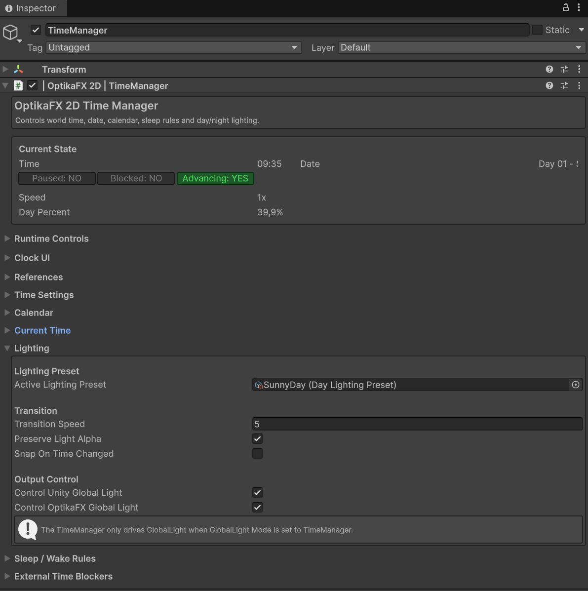
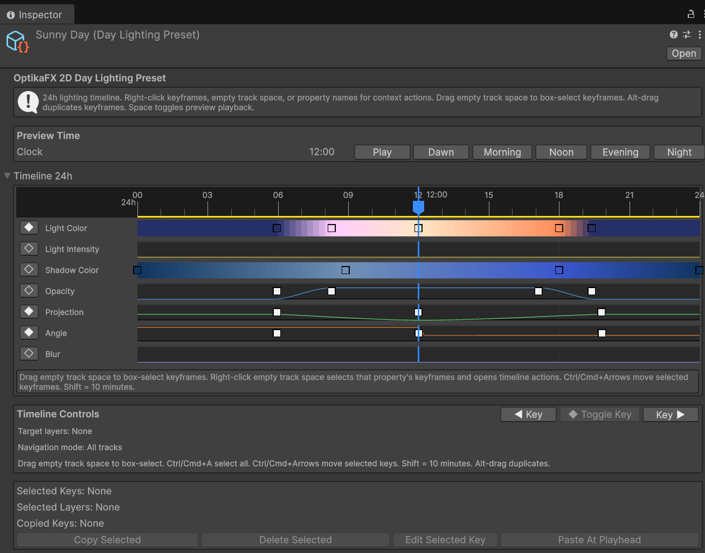
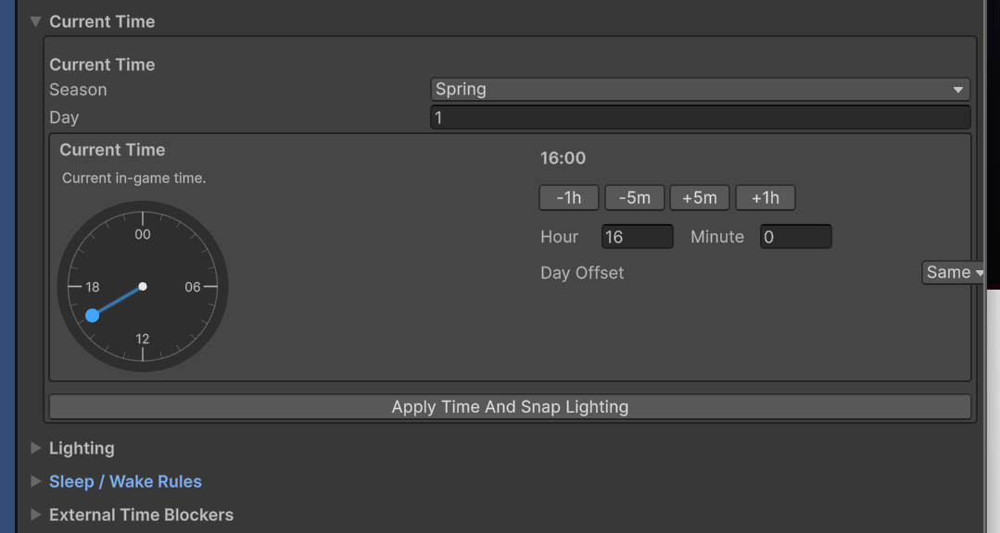


# TimeManager

The `TimeManager` controls in-game time, date, seasons, sleep rules, pause/block states, and day/night lighting for OptikaFX 2D.

It can drive both the Unity `Light2D` Global Light and the OptikaFX `GlobalLight` component through a `DayLightingPreset`.


## Index

- [Overview](#overview)
- [Default Setup](#default-setup)
- [Enabling Day Lighting Presets](#enabling-day-lighting-presets)
- [Day Lighting Presets Animation](#day-lighting-presets-animation)
- [Main Fields](#main-fields)
- [Sleep and Wake Rules](#sleep-and-wake-rules)
- [Runtime Controls in Inspector](#runtime-controls-in-inspector)
- [Clock UI](#clock-ui)
- [Useful C# Examples](#useful-c-examples)
  - [Get the TimeManager instance](#get-the-timemanager-instance)
  - [Set a specific time](#set-a-specific-time)
  - [Set date and time](#set-date-and-time)
  - [Advance time](#advance-time)
  - [Rewind time](#rewind-time)
  - [Skip time](#skip-time)
  - [Pause and resume time](#pause-and-resume-time)
  - [Pause time by tag](#pause-time-by-tag)
  - [Check if a tag is pausing time](#check-if-a-tag-is-pausing-time)
  - [Block time with an external component](#block-time-with-an-external-component)
  - [Register a runtime time blocker](#register-a-runtime-time-blocker)
  - [Change time speed](#change-time-speed)
  - [Sleep](#sleep)
  - [Skip to next day wake time](#skip-to-next-day-wake-time)
  - [Listen for time changes](#listen-for-time-changes)
  - [Listen for date changes](#listen-for-date-changes)
  - [Listen for sleep and wake events](#listen-for-sleep-and-wake-events)
  - [Listen for pause state changes](#listen-for-pause-state-changes)
  - [Listen for world block state changes](#listen-for-world-block-state-changes)
  - [Listen for time speed changes](#listen-for-time-speed-changes)
  - [Assign a lighting preset from code](#assign-a-lighting-preset-from-code)
  - [Force lighting update](#force-lighting-update)
  - [Get formatted time and date](#get-formatted-time-and-date)
- [Recommended Usage](#recommended-usage)
- [Troubleshooting](#troubleshooting)

---

## Overview



The TimeManager can be used to:

- Advance in-game time automatically
- Set, skip, rewind or pause time
- Control day and season progression
- Trigger sleep, forced sleep and wake-up events
- Drive day/night lighting presets
- Block time progression from external systems
- Notify gameplay systems when time/date changes
- Connect to optional Clock UI

---

## Default Setup

When using:

**OptikaFX 2D / 01. Run Full Setup**

OptikaFX creates this hierarchy:

```text
OptikaFX 2D Manager
├── Global Light
└── TimeManager

```

By default:

- The `TimeManager` GameObject is active.
- The `TimeManager` component starts disabled.
- The `GlobalLight` starts in `Manual` mode.
- When the `TimeManager` component is enabled, `GlobalLight` automatically switches to `TimeManager` mode.
- When the `TimeManager` component is disabled, `GlobalLight` returns to `Manual` mode.

---
## Enabling Day Lighting Presets

To enable day/night lighting:

1. Select the `TimeManager` object.
2. Enable the `TimeManager` component.
3. Make sure a `DayLightingPreset` is assigned.

If no preset is assigned, the TimeManager can automatically assign:

```text
Assets/OptikaFX 2D/DayLightingPresets/SunnyDay.asset
```

The preset is only assigned if the current field is empty, so custom presets are not overwritten.


## Day Lighting Presets Animation

The Day Lighting Presets feature an animation timeline that controls color, angle, projection, alpha, and softness over a 24-hour cycle.
Feel free to test the system and create your own custom presets and animations.



How to create a new preset:

1. Right-click inside the Unity Project tab.
2. Navigate to Create / OptikaFX / Lighting / Day Lighting Preset


**Default File Location:**
```text
Assets/OptikaFX 2D/DayLightingPresets
```


---

## Main Fields

### References

The TimeManager can control:

- Unity `Light2D` Global Light
- OptikaFX `GlobalLight`

Normally these are assigned automatically by setup.

---
### Time Settings

| Field | Description |
|---|---|
| `Real Seconds Per In-Game Minute` | How many real seconds equal one in-game minute. |
| `Use Unscaled Time` | Uses `Time.unscaledDeltaTime` instead of `Time.deltaTime`. Useful during pauses/cutscenes. |
| `Time Speed Multiplier` | Multiplies time speed. `1` is normal, `2` is double speed, `0` stops time. |
| `Use Extended Hours Until Sleep` | Allows hours above 23, such as `27:45`, useful for games where the day ends only after sleeping. |
---
### Current Time

The TimeManager uses a 24-hour clock instead of a 12-hour format, enabling full-day light transition control.



| Field | Description |
|---|---|
| `Current Season` | Current season. |
| `Current Day` | Current day number. |
| `Current Hour` | Current in-game hour. |
| `Current Minute` | Current in-game minute. |
---
### Calendar

| Field | Description |
|---|---|
| `Days In Season` | Number of days before season changes. |
| `Day Label` | Label used by formatted date, for example `Day`. |
| `Use Leading Zero` | Displays `Day 01` instead of `Day 1`. |
| `Season Names` | Custom display names for Spring, Summer, Autumn and Winter. |

---

### Lighting

| Field | Description |
|---|---|
| `Active Lighting Preset` | The `DayLightingPreset` used to evaluate light and shadow values. |
| `Auto Assign SunnyDay Preset On Enable` | Automatically assigns `SunnyDay.asset` when the TimeManager is enabled and no preset is assigned. |
| `Transition Speed` | Speed used to interpolate lighting/shadow values. |
| `Preserve Light Alpha` | Keeps the original alpha from the Unity Global Light color. |
| `Snap On Time Changed` | Applies lighting instantly when time changes. |
| `Control Unity Global Light` | Allows TimeManager to drive Unity `Light2D`. |
| `Control OptikaFX Global Light` | Allows TimeManager to drive OptikaFX `GlobalLight` when it is in `TimeManager` mode. |

---

## Sleep and Wake Rules

The TimeManager supports normal sleep, late sleep penalty and forced sleep.

### Normal Wake

Defines the default wake-up time after normal sleep.

### Late Sleep Penalty

If enabled, sleeping after a configured threshold wakes the player later.

Example:

```text
Late Sleep Threshold: 22:00
Late Wake Time: 10:45
```

### Forced Sleep / Pass Out

If enabled, the player can be forced to sleep after a configured time.

Example:

```text
Forced Sleep At: 27:45
Wake After Forced Sleep: 14:00
```

If `Use Extended Hours Until Sleep` is enabled, values above `23` are valid.

Example:

```text
27:45 = 03:45 AM on the next day
```

---

## Runtime Controls in Inspector

The custom TimeManager inspector provides shortcuts for:

- Morning
- Noon
- Evening
- Night
- Rewind/advance time
- Sleep
- Forced sleep
- Next day wake
- Pause/resume
- Time speed presets
- Snap lighting
- Ping lighting preset

These are useful for testing day/night transitions directly in the editor.

---

## Clock UI

The TimeManager can create an optional Clock UI.

Clock UI requires TextMeshPro.

In the TimeManager inspector, open:

```text
Clock UI

```

Then click:

```text
Create Clock UI Canvas
```

If TextMeshPro is not installed, OptikaFX will ask for permission to install it through Unity Package Manager.

The Clock UI is created from a prefab template and unpacked automatically, so it can be freely edited in the scene.

---

## Useful C# Examples

---

## Get the TimeManager instance

```csharp
using UnityEngine;
using OptikaFX;

public class TimeExample : MonoBehaviour
{
    private void Start()
    {
        TimeManager timeManager = TimeManager.Instance;

        if (timeManager == null)
        {
            Debug.LogWarning("No TimeManager found.");
            return;
        }

        Debug.Log(timeManager.GetFormattedTime());
    }
}

```

---

## Set a specific time

```csharp
using UnityEngine;
using OptikaFX;

public class SetTimeExample : MonoBehaviour
{
    [SerializeField]
    private TimeManager timeManager;

    private void Start()
    {
        if (timeManager == null)
            timeManager = TimeManager.Instance;

        if (timeManager == null)
            return;

        timeManager.SetTime(18, 30);
    }
}

```

This sets the time to:

```text
18:30
```

---

## Set date and time

```csharp
using UnityEngine;
using OptikaFX;

public class SetDateTimeExample : MonoBehaviour
{
    private void Start()
    {
        TimeManager timeManager = TimeManager.Instance;

        if (timeManager == null)
            return;

        timeManager.SetDateTime(12, TimeManager.Season.Summer, 14, 45);
    }
}

```

This sets:

```text
Day 12 - Summer
14:45
```

---

## Advance time

```csharp
using UnityEngine;
using OptikaFX;

public class AdvanceTimeExample : MonoBehaviour
{
    public void AddOneHour()
    {
        if (TimeManager.Instance == null)
            return;

        TimeManager.Instance.AdvanceHours(1);
    }

    public void AddTenMinutes()
    {
        if (TimeManager.Instance == null)
            return;

        TimeManager.Instance.AdvanceMinutes(10);
    }
}

```

---

## Rewind time

```csharp
using UnityEngine;
using OptikaFX;

public class RewindTimeExample : MonoBehaviour
{
    public void RewindOneHour()
    {
        if (TimeManager.Instance == null)
            return;

        TimeManager.Instance.RewindHours(1);
    }

    public void RewindTenMinutes()
    {
        if (TimeManager.Instance == null)
            return;

        TimeManager.Instance.RewindMinutes(10);
    }
}

```

---

## Skip time

```csharp
using UnityEngine;
using OptikaFX;

public class SkipTimeExample : MonoBehaviour
{
    public void SkipThreeHours()
    {
        if (TimeManager.Instance == null)
            return;

        TimeManager.Instance.SkipTime(3);
    }

    public void SkipTwoHoursAndThirtyMinutes()
    {
        if (TimeManager.Instance == null)
            return;

        TimeManager.Instance.SkipTime(2, 30);
    }
}

```

---

## Pause and resume time

```csharp
using UnityEngine;
using OptikaFX;

public class PauseTimeExample : MonoBehaviour
{
    public void Pause()
    {
        if (TimeManager.Instance == null)
            return;

        TimeManager.Instance.PauseTime(true);
    }

    public void Resume()
    {
        if (TimeManager.Instance == null)
            return;

        TimeManager.Instance.PauseTime(false);
    }

    public void TogglePause()
    {
        if (TimeManager.Instance == null)
            return;

        TimeManager.Instance.PauseTime(!TimeManager.Instance.IsTimePaused);
    }
}

```

---

## Pause time by tag

Pause tags are useful when several systems can pause time independently.

Example:

```csharp
using UnityEngine;
using OptikaFX;

public class DialoguePauseExample : MonoBehaviour
{
    private const string PauseTag = "Dialogue";

    public void OnDialogueStarted()
    {
        if (TimeManager.Instance == null)
            return;

        TimeManager.Instance.PauseTimeByTag(PauseTag);
    }

    public void OnDialogueEnded()
    {
        if (TimeManager.Instance == null)
            return;

        TimeManager.Instance.ResumeTimeByTag(PauseTag);
    }
}

```

This allows dialogue to pause time without interfering with other systems.

---

## Check if a tag is pausing time

```csharp
using UnityEngine;
using OptikaFX;

public class CheckPauseTagExample : MonoBehaviour
{
    private void Update()
    {
        if (TimeManager.Instance == null)
            return;

        bool pausedByDialogue = TimeManager.Instance.IsPausedByTag("Dialogue");

        if (pausedByDialogue)
        {
            Debug.Log("Time is paused by dialogue.");
        }
    }
}

```

---

## Block time with an external component

The TimeManager supports external blockers using components that implement `ITimeBlocker`.

Example:

```csharp
using UnityEngine;
using OptikaFX;

public class CutsceneTimeBlocker : MonoBehaviour, ITimeBlocker
{
    [SerializeField]
    private bool isCutscenePlaying;

    public bool IsTimeBlocked => isCutscenePlaying;

    public void StartCutscene()
    {
        isCutscenePlaying = true;
    }

    public void EndCutscene()
    {
        isCutscenePlaying = false;
    }
}

```

Then add this component to the TimeManager's:

```text
External Time Blockers
```

list.

When `IsTimeBlocked` returns `true`, world time stops advancing.

---

## Register a runtime time blocker

You can also register blockers from code.

```csharp
using UnityEngine;
using OptikaFX;

public class RuntimeBlockerExample : MonoBehaviour
{
    private bool inventoryOpen;

    private void OnEnable()
    {
        if (TimeManager.Instance == null)
            return;

        TimeManager.Instance.RegisterRuntimeTimeBlocker(IsInventoryBlockingTime);
    }

    private void OnDisable()
    {
        if (TimeManager.Instance == null)
            return;

        TimeManager.Instance.UnregisterRuntimeTimeBlocker(IsInventoryBlockingTime);
    }

    private bool IsInventoryBlockingTime()
    {
        return inventoryOpen;
    }

    public void OpenInventory()
    {
        inventoryOpen = true;
    }

    public void CloseInventory()
    {
        inventoryOpen = false;
    }
}

```

---

## Change time speed

```csharp
using UnityEngine;
using OptikaFX;

public class TimeSpeedExample : MonoBehaviour
{
    public void NormalSpeed()
    {
        TimeManager.Instance?.SetTimeSpeedMultiplier(1f);
    }

    public void FastForward()
    {
        TimeManager.Instance?.SetTimeSpeedMultiplier(5f);
    }

    public void StopTime()
    {
        TimeManager.Instance?.SetTimeSpeedMultiplier(0f);
    }

    public void ResetSpeed()
    {
        TimeManager.Instance?.ResetTimeSpeedMultiplier();
    }
}

```

---

## Sleep

```csharp
using UnityEngine;
using OptikaFX;

public class SleepExample : MonoBehaviour
{
    public void SleepNow()
    {
        if (TimeManager.Instance == null)
            return;

        TimeManager.Instance.Sleep();
    }

    public void ForcedSleep()
    {
        if (TimeManager.Instance == null)
            return;

        TimeManager.Instance.Sleep(TimeManager.SleepReason.Forced);
    }

    public void PassedOut()
    {
        if (TimeManager.Instance == null)
            return;

        TimeManager.Instance.Sleep(TimeManager.SleepReason.PassedOut);
    }
}

```

---

## Skip to next day wake time

```csharp
using UnityEngine;
using OptikaFX;

public class NextDayExample : MonoBehaviour
{
    public void WakeNextDay()
    {
        if (TimeManager.Instance == null)
            return;

        TimeManager.Instance.SkipToNextDayWakeTime();
    }
}

```

---

## Listen for time changes

```csharp
using UnityEngine;
using OptikaFX;

public class TimeListenerExample : MonoBehaviour
{
    private void OnEnable()
    {
        if (TimeManager.Instance == null)
            return;

        TimeManager.Instance.OnTimeChanged += HandleTimeChanged;
    }

    private void OnDisable()
    {
        if (TimeManager.Instance == null)
            return;

        TimeManager.Instance.OnTimeChanged -= HandleTimeChanged;
    }

    private void HandleTimeChanged(int hour, int minute)
    {
        Debug.Log($"Time changed: {hour:00}:{minute:00}");
    }
}

```

---

## Listen for date changes

```csharp
using UnityEngine;
using OptikaFX;

public class DateListenerExample : MonoBehaviour
{
    private void OnEnable()
    {
        if (TimeManager.Instance == null)
            return;

        TimeManager.Instance.OnDateChanged += HandleDateChanged;
    }

    private void OnDisable()
    {
        if (TimeManager.Instance == null)
            return;

        TimeManager.Instance.OnDateChanged -= HandleDateChanged;
    }

    private void HandleDateChanged(int day, TimeManager.Season season)
    {
        Debug.Log($"Date changed: Day {day}, Season {season}");
    }
}

```

---

## Listen for sleep and wake events

```csharp
using UnityEngine;
using OptikaFX;

public class SleepListenerExample : MonoBehaviour
{
    private void OnEnable()
    {
        if (TimeManager.Instance == null)
            return;

        TimeManager.Instance.OnSleepStarted += HandleSleepStarted;
        TimeManager.Instance.OnWakeUp += HandleWakeUp;
    }

    private void OnDisable()
    {
        if (TimeManager.Instance == null)
            return;

        TimeManager.Instance.OnSleepStarted -= HandleSleepStarted;
        TimeManager.Instance.OnWakeUp -= HandleWakeUp;
    }

    private void HandleSleepStarted(TimeManager.SleepReason reason)
    {
        Debug.Log("Sleep started: " + reason);
    }

    private void HandleWakeUp(TimeManager.SleepReason reason)
    {
        Debug.Log("Woke up from: " + reason);
    }
}

```

---

## Listen for pause state changes

```csharp
using UnityEngine;
using OptikaFX;

public class PauseListenerExample : MonoBehaviour
{
    private void OnEnable()
    {
        if (TimeManager.Instance == null)
            return;

        TimeManager.Instance.OnTimePauseStateChanged += HandlePauseChanged;
    }

    private void OnDisable()
    {
        if (TimeManager.Instance == null)
            return;

        TimeManager.Instance.OnTimePauseStateChanged -= HandlePauseChanged;
    }

    private void HandlePauseChanged(bool isPaused)
    {
        Debug.Log("Time paused: " + isPaused);
    }
}

```

---

## Listen for world block state changes

```csharp
using UnityEngine;
using OptikaFX;

public class WorldBlockListenerExample : MonoBehaviour
{
    private void OnEnable()
    {
        if (TimeManager.Instance == null)
            return;

        TimeManager.Instance.OnWorldTimeBlockStateChanged += HandleBlockedChanged;
    }

    private void OnDisable()
    {
        if (TimeManager.Instance == null)
            return;

        TimeManager.Instance.OnWorldTimeBlockStateChanged -= HandleBlockedChanged;
    }

    private void HandleBlockedChanged(bool isBlocked)
    {
        Debug.Log("World time blocked: " + isBlocked);
    }
}

```

---

## Listen for time speed changes

```csharp
using UnityEngine;
using OptikaFX;

public class TimeSpeedListenerExample : MonoBehaviour
{
    private void OnEnable()
    {
        if (TimeManager.Instance == null)
            return;

        TimeManager.Instance.OnTimeSpeedChanged += HandleSpeedChanged;
    }

    private void OnDisable()
    {
        if (TimeManager.Instance == null)
            return;

        TimeManager.Instance.OnTimeSpeedChanged -= HandleSpeedChanged;
    }

    private void HandleSpeedChanged(float speed)
    {
        Debug.Log("Time speed changed: " + speed + "x");
    }
}

```

---

## Assign a lighting preset from code

```csharp
using UnityEngine;
using OptikaFX;

public class LightingPresetExample : MonoBehaviour
{
    [SerializeField]
    private DayLightingPreset preset;

    public void ApplyPreset()
    {
        if (TimeManager.Instance == null)
            return;

        TimeManager.Instance.SetActiveLightingPreset(preset, true);
    }
}

```

The second parameter controls whether lighting should snap immediately.

---

## Force lighting update

```csharp
using UnityEngine;
using OptikaFX;

public class SnapLightingExample : MonoBehaviour
{
    public void SnapLighting()
    {
        if (TimeManager.Instance == null)
            return;

        TimeManager.Instance.SnapLightingAndShadows();
    }
}

```

---

## Get formatted time and date

```csharp
using UnityEngine;
using OptikaFX;

public class FormattedTimeExample : MonoBehaviour
{
    private void Start()
    {
        if (TimeManager.Instance == null)
            return;

        string time = TimeManager.Instance.GetFormattedTime();

        string day = TimeManager.Instance.GetFormattedDay();

        string season = TimeManager.Instance.GetSeasonDisplayName();

        string date = TimeManager.Instance.GetFormattedDate();

        Debug.Log(time);
        Debug.Log(day);
        Debug.Log(season);
        Debug.Log(date);
    }
}

```

---

## Recommended Usage

For most projects:

1. Run Full Setup.
2. Enable the TimeManager component only when day/night control is needed.
3. Assign or auto-load a `DayLightingPreset`.
4. Use events to connect gameplay systems.
5. Use pause tags or blockers for UI, dialogue, cutscenes and menus.
6. Use Clock UI only if TextMeshPro is installed.

---

## Troubleshooting

### Time does not advance

Check:

- TimeManager component is enabled
- `Time Speed Multiplier` is above `0`
- Time is not paused
- No external blocker is active
- `Real Seconds Per In-Game Minute` is above `0`

### Global Light does not follow TimeManager

Check:

- TimeManager component is enabled
- GlobalLight mode is `TimeManager`
- `Control OptikaFX Global Light` is enabled
- GlobalLight exists in the scene

### Global Light still uses TimeManager values when disabled

When the TimeManager component is disabled, GlobalLight should automatically return to Manual mode.

If it does not, check:

- There is no other active TimeManager in the scene
- `Sync Mode With TimeManager State` is enabled on GlobalLight
- The previous manual values were stored before TimeManager mode was enabled

### Clock UI does not update

Check:

- TimeManager exists and is enabled
- ClockUI has a valid TimeManager reference
- `Auto Find TimeManager` is enabled
- Date Text and Time Text are assigned
- TextMeshPro is installed

← [Back to Documentation Index](index.md)
